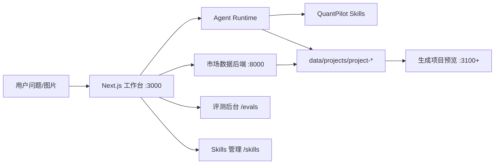

# QuantPilot

QuantPilot 是面向量化投研、金融数据分析和可视化看板生成的 AI 工作台。项目当前的核心目标是让用户用自然语言发起分析任务，然后由 Agent 先规划、再取数、再验证、最后生成可复查的量化分析工作空间。

本项目生成的分析结果仅用于研究、复盘和辅助决策，不构成投资建议、收益承诺或即时交易指令。

## 当前能力

- **AI 工作台**：首页任务入口、项目聊天、生成过程展示、工作空间预览和任务记录。
- **模型运行时**：默认使用 `Claude Code + MiniMax M2.7`，可选 `Codex CLI + GPT-5.5`。
- **量化数据后端**：Python 3.14 + FastAPI + uv，默认在 `8000` 端口提供行情、K 线、财务、公告、指标和回测数据。
- **Skills 能力层**：统一管理 `.claude/skills`，支持源码编辑、文件树管理、版本发布、发布前 diff、回滚和压缩包导入。
- **可视化生成**：按分析场景生成金融看板，优先绑定真实数据文件和同源数据代理。
- **自动验证与评测**：生成后自动检查 build、HTTP 200、数据文件、证据文件、图表存在性和生成产物策略；支持 `/evals` 评测后台。

## 架构总览



一次完整任务的主链路：

1. 用户输入问题，必要时上传截图。
2. Agent 使用 `quant-run-planner` 判断意图是否清晰。
3. 信息不足时进入澄清，用户补充后自动承接上一轮问题。
4. 信息完整后生成 `.quantpilot/run_plan.json`。
5. 平台根据 run plan 调用 `8000` 后端获取真实数据。
6. 数据、来源和质量报告写入工作空间。
7. Agent 使用可视化 skill 生成 Next.js 看板。
8. 平台执行自动验证，失败时生成修复计划并触发修复。

## 目录结构

| 路径 | 说明 |
| --- | --- |
| `app/` | Next.js App Router 页面和 API |
| `app/page.tsx` | 首页任务入口 |
| `app/[project_id]/chat/` | 项目聊天、执行过程、预览和生成工作台 |
| `app/skills/` | Skills 管理界面 |
| `app/evals/` | Agent 评测后台 |
| `backend/market_data/` | Python/FastAPI 量化数据后端 |
| `.claude/skills/` | 核心 skills 源码目录 |
| `.claude/skill-packages/` | skills 发布包和历史版本包 |
| `.claude/skills.registry.json` | skills 注册表、能力边界、输入输出和兼容 alias |
| `.claude/skills.lock.json` | 当前发布版本、源码 hash 和包 hash |
| `.claude/skills.changelog.json` | skills 发版记录 |
| `benchmarks/quantpilot/` | 固定评测用例 |
| `components/` | UI 与业务组件 |
| `contexts/` | 前端上下文 |
| `hooks/` | 前端 hooks |
| `lib/constants/` | CLI 和模型注册 |
| `lib/services/cli/` | Claude Code、Codex 等运行时封装 |
| `lib/quant/` | run plan、预取、证据、验证、评测和 skills 管理 |
| `lib/utils/scaffold.ts` | 生成项目脚手架 |
| `scripts/` | 启动、构建、检查、评测和打包脚本 |
| `docs/` | 设计、治理和迁移文档 |
| `data/projects/` | 本地生成的项目工作空间，默认不提交 |
| `tmp/` | 本地报告、临时文件和规划文档，默认不提交 |

## 环境要求

- Node.js >= 20.19.0，推荐 Node.js 24。
- npm >= 10。
- Python 3.14。
- uv。
- Git。
- Claude Code CLI。
- MiniMax API Token。

可选：

- Codex CLI，用于 OpenAI-compatible GPT 运行时。
- GitHub、Vercel、Supabase 等第三方集成凭据。

## 快速启动

### 1. 初始化前端

```bash
npm install
cp .env.example .env
cp .env.example .env.local
```

把 `.env` 或 `.env.local` 中的模型 token 改成你自己的值。真实密钥不要提交到 Git。

### 2. 启动量化数据后端

```bash
cd backend/market_data
uv sync
uv run quantpilot-market-api
```

检查后端：

```bash
curl http://127.0.0.1:8000/health
curl "http://127.0.0.1:8000/api/v1/quotes/realtime/600519"
```

### 3. 启动主前端

回到项目根目录：

```bash
npm run dev
```

默认访问：

```text
http://localhost:3000
```

推荐启动顺序是先启动 `8000` 后端，再启动 `3000` 前端。

## 端口约定

| 服务 | 默认地址 | 说明 |
| --- | --- | --- |
| QuantPilot 主前端 | `http://localhost:3000` | 首页、项目聊天、skills 管理、评测后台 |
| 量化数据后端 | `http://127.0.0.1:8000` | FastAPI 金融数据服务 |
| 生成项目预览 | `http://localhost:3100` 起 | 每个工作空间自动分配独立端口 |

主前端应优先保持在 `3000`。如果脚本自动切到 `3001`，通常说明 `3000` 已被占用，建议先释放端口再重新启动。

## 环境变量

### Claude Code + MiniMax

默认运行时是 Claude Code，默认模型是 MiniMax M2.7。

```env
ANTHROPIC_BASE_URL="https://api.minimaxi.com/anthropic"
ANTHROPIC_AUTH_TOKEN="replace-with-your-minimax-token"
API_TIMEOUT_MS=3000000
CLAUDE_CODE_DISABLE_NONESSENTIAL_TRAFFIC=1
ANTHROPIC_MODEL="MiniMax-M2.7"
ANTHROPIC_SMALL_FAST_MODEL="MiniMax-M2.7"
ANTHROPIC_DEFAULT_SONNET_MODEL="MiniMax-M2.7"
ANTHROPIC_DEFAULT_OPUS_MODEL="MiniMax-M2.7"
ANTHROPIC_DEFAULT_HAIKU_MODEL="MiniMax-M2.7"
```

可以用脚本写入本机 Claude Code 配置：

```bash
bash claude_code_minimax_env.sh
```

MiniMax M2.7 没有 `low/high/xhigh` reasoning 档位，前端和评测不会为 MiniMax 链路展示 reasoning 选择。

### Codex CLI + GPT-5.5

Codex CLI 用于接入 OpenAI-compatible GPT。当前只注册 `gpt-5.5`，reasoning 默认 `low`。

```env
CODEX_MODEL="gpt-5.5"
CODEX_MODEL_REASONING_EFFORT="low"
CODEX_OPENAI_BASE_URL="https://w.ciykj.cn"
CODEX_OPENAI_API_KEY="replace-with-your-openai-compatible-key"
CODEX_EXECUTABLE="/path/to/codex"
CODEX_MAX_TURNS=20
CODEX_MAX_THINKING_TOKENS=4096
```

建议把真实 key 放在 `.env.local`、shell 环境变量或 `~/.codex/auth.json`，不要写入代码。

### 后端与缓存

```env
QUANTPILOT_MARKET_HOST="127.0.0.1"
QUANTPILOT_MARKET_PORT=8000
QUANTPILOT_MARKET_RELOAD=0
QUANTPILOT_MARKET_CACHE_ENABLED=1
QUANTPILOT_MARKET_CACHE_DIR="~/.cache/quantpilot/market_data"
```

### 本地数据库与预览

```env
DATABASE_URL="file:../data/cc.db"
PROJECTS_DIR="./data/projects"
ENCRYPTION_KEY="replace-with-a-64-character-hex-secret"
PORT=3000
WEB_PORT=3000
NEXT_PUBLIC_APP_URL="http://localhost:3000"
PREVIEW_PORT_START=3100
PREVIEW_PORT_END=3999
```

## 模型与 CLI 注册

模型和 CLI 的注册入口：

- `lib/constants/cliModels.ts`
- `lib/constants/claudeModels.ts`
- `lib/constants/codexModels.ts`
- `lib/services/cli/claude.ts`
- `lib/services/cli/codex.ts`

当前推荐组合：

| 执行器 | 模型 | 用途 | Reasoning |
| --- | --- | --- | --- |
| `claude` | `MiniMax-M2.7` | 默认分析、默认评测 | 不展示 |
| `codex` | `gpt-5.5` | GPT 兼容链路和对照评测 | 默认 `low` |

## 量化数据后端

后端位于 `backend/market_data`，当前默认以东方财富为主数据源，并提供候选免费信源探针。核心响应统一携带：

- `source`
- `asset_type`
- `as_of`
- `fetched_at`
- `fetch`
- `data_quality`

主要接口：

| 能力 | 方法与路径 |
| --- | --- |
| 健康检查 | `GET /health` |
| 数据源注册表 | `GET /api/v1/registry` |
| 候选信源 | `GET /api/v1/provider-candidates` |
| 候选信源探针 | `GET /api/v1/provider-candidates/probe` |
| 标的解析 | `GET /api/v1/symbols/resolve?query=贵州茅台&count=5` |
| 单只实时行情 | `GET /api/v1/quotes/realtime/{symbol}` |
| 批量实时行情 | `POST /api/v1/quotes/realtime` |
| 历史 K 线 | `GET /api/v1/quotes/history/{symbol}?period=daily&adjustment=qfq&limit=120` |
| 技术指标 | `GET /api/v1/indicators/technical/{symbol}` |
| 均线突破回测 | `GET /api/v1/backtests/ma-crossover/{symbol}` |
| 财务报表 | `GET /api/v1/fundamentals/financials/{symbol}?limit=8` |
| 财务衍生指标 | `GET /api/v1/indicators/fundamental/{symbol}?limit=8` |
| 公告事件 | `GET /api/v1/events/announcements/{symbol}?limit=20` |

常用示例：

```bash
curl "http://127.0.0.1:8000/api/v1/symbols/resolve?query=贵州茅台&count=5"
curl "http://127.0.0.1:8000/api/v1/quotes/history/600519?period=daily&adjustment=qfq&limit=120"
curl "http://127.0.0.1:8000/api/v1/fundamentals/financials/600519?limit=8"
curl "http://127.0.0.1:8000/api/v1/backtests/ma-crossover/510300?fast_window=20&slow_window=60&limit=250&fee_bps=5"
```

更多后端细节见 `backend/market_data/README.md`。

## Skills 管理

Skills 是 Agent 的稳定能力边界，统一放在 `.claude/skills/`。生成项目时，平台会把当前发布的核心 skills 安装到对应 workspace 的 `.claude/skills/` 下。

管理入口：

```text
http://localhost:3000/skills
```

当前支持：

- 搜索和切换 skill。
- 查看源码文件树。
- 在线编辑 `SKILL.md`、`scripts/`、`references/` 等目录内文件。
- 创建、删除文件和文件夹。
- 上传 `.zip`、`.tgz` 或 `.tar.gz` 作为新版本来源。
- 发布前生成 diff，对比本地源码目录和上一版发布包。
- 确认 diff 后发布新版本。
- 一键回滚历史版本。
- 下载 skill 包。

核心治理文件：

| 文件 | 作用 |
| --- | --- |
| `.claude/skills.registry.json` | 核心 skill、边界、输入输出、脚本和兼容 alias |
| `.claude/skills.lock.json` | 当前发布版本、源码 hash、包 hash |
| `.claude/skills.changelog.json` | 发版记录 |
| `.claude/skill-packages/*.tgz` | 当前版本发布包 |
| `.claude/skill-packages/versions/**` | 历史版本包 |

当前核心 skills：

| Skill | 状态 | 作用 |
| --- | --- | --- |
| `quant-run-planner` | stable | 意图澄清、澄清承接、任务规划、run plan |
| `quant-data-registry` | stable | 数据能力和信源选择 |
| `quant-symbol-resolver` | stable | 股票、指数、ETF 标的解析 |
| `quant-image-extraction` | stable | 上传图片和持仓截图字段提取 |
| `quant-market-data` | stable | 实时行情、历史 K 线、指数 ETF、批量行情 |
| `quant-fundamentals` | planned | 财务报表、财务指标、公告事件 |
| `quant-indicators` | planned | 技术指标、收益、回撤、波动、相关性 |
| `quant-backtest` | stable | 策略参数、回测、净值、回撤、交易明细 |
| `quant-data-quality` | stable | 来源、时效、缺失字段、warning 和限制说明 |
| `quant-visualization-html` | stable | 基于 final 数据生成金融可视化看板 |

修改后建议运行：

```bash
npm run check:skills
npm run package:skills
```

## 生成项目契约

新建 workspace 会自动带上金融看板基础模板：

```text
app/page.tsx
app/globals.css
app/api/market/[...path]/route.ts
```

平台预取数据时会写入：

```text
.quantpilot/run_plan.json
.quantpilot/events.jsonl
data_file/raw/<run_id>/
data_file/final/dashboard-data.json
evidence/sources.json
evidence/data_quality.json
```

生成页面必须遵守：

- 使用真实数据，不保留 mock、static、sample 数据。
- 不引用外部 CDN、远程脚本、远程样式、远程字体。
- 不把 token、api key、cookie、authorization 写入生成项目。
- 金融图表应包含真实数据驱动的 K 线、成交量、指标、财务趋势、对比或风险组件。
- A 股视觉习惯使用红涨绿跌。
- 数据缺失时展示限制、warning 和人工确认项，不编造结论。
- 可视化应优先匹配具体分析场景，而不是套用单一通用页面。

## 自动验证

Agent 执行完成后，平台会自动验证生成项目。验证报告写入：

```text
.quantpilot/validation.json
.quantpilot/validation-repair-plan.json
```

验证项包括：

- `npm run build`。
- 预览首页 HTTP 200。
- `data_file/final/dashboard-data.json` 存在且包含真实数据。
- `evidence/sources.json` 和 `evidence/data_quality.json` 存在。
- 页面绑定真实数据或同源 `/api/market` 代理。
- 页面包含金融图表。
- 生成项目没有外部 CDN、mock 数据或明文密钥。

手动验证：

```bash
curl -X POST "http://localhost:3000/api/projects/<project_id>/quant/validation"
curl "http://localhost:3000/api/projects/<project_id>/quant/validation"
```

本地检查脚本：

```bash
npm run check:homepage
PROJECT_ID=<project_id> npm run check:project-visual
npm run check:validation-repair
npm run check:generated-artifacts
```

## Agent 评测后台

评测后台入口：

```text
http://localhost:3000/evals
```

默认评测运行时：

- 执行器：`Claude Code`
- 模型：`MiniMax M2.7`
- Reasoning：不展示、不传递

可选运行时：

- 执行器：`Codex CLI`
- 模型：`GPT-5.5`
- Reasoning：`low`、`medium`、`high`、`xhigh`

评测能力：

- 一键运行 benchmark。
- 运行队列。
- 取消运行。
- 模型对比。
- Skill 版本影响分析。
- 失败自动生成修复单。
- 定时回归配置。
- CI 阻断策略。

命令行运行：

```bash
npm run benchmark:quant
npm run benchmark:quant -- --case stock-fundamental-maotai
npm run benchmark:quant -- --case runtime-registry-codex-gpt55 --cli codex --model gpt-5.5 --reasoning-effort low
```

评测报告写入：

```text
tmp/quantpilot-benchmark-reports/
tmp/quantpilot-eval-queue/
tmp/quantpilot-eval-repairs/
```

这些目录不进入 Git。

## 常用命令

```bash
# 前端
npm run dev
npm run build
npm run build:standalone
npm run start
npm run lint
npm run type-check

# 数据库
npm run prisma:generate
npm run prisma:push
npm run prisma:migrate
npm run prisma:studio
npm run prisma:reset

# CLI 与模型
npm run check-cli

# Skills
npm run check:skills
npm run check:skills:metadata
npm run package:skills

# 验证与评测
npm run check:homepage
npm run check:validation-repair
npm run check:validation-stale
npm run check:generated-artifacts
npm run check:benchmark-coverage
npm run check:eval-schedule
npm run eval:ci
npm run benchmark:quant

# 后端
cd backend/market_data
uv sync
uv run quantpilot-market-api
uv run ruff check .
uv run pytest
```

## 构建与开发模式

主应用通过脚本统一启动和构建：

- `scripts/run-web.js`：开发服务、端口管理、环境初始化、数据库检查、稳定 CSS 生成。
- `scripts/run-build.js`：生产构建，构建前会停止根项目 `3000` 开发服务。

当前主应用默认走 Rspack 接入；如果检测到 Rspack 开发缓存异常，启动脚本会自动切换到 Next Turbopack 稳定模式。需要手动诊断时可以临时设置：

```bash
QUANTPILOT_BUNDLER=turbo npm run dev
```

`npm run build` 默认跳过服务端 route 的 per-route output tracing，避免在 `.git`、`.next`、`data/projects` 等目录上做耗时追踪。需要完整 standalone 输出时使用：

```bash
npm run build:standalone
```

## 质量门与依赖升级

GitHub Actions 当前包含：

- 前端：`npm ci`、`npm run lint`、`npm run type-check`、`npm run build`。
- 后端：`uv sync --locked --all-groups`、`uv run ruff check .`、`uv run pytest`。

Dependabot 每周检查：

- 根目录 npm 依赖。
- `backend/market_data` uv 依赖。
- GitHub Actions。

手动升级建议：

```bash
# 前端
npm outdated --long
npm install <package>@latest
npm run lint
npm run type-check
npm run build

# 后端
cd backend/market_data
uv tree --outdated --depth 1
uv lock --upgrade-package <package>
uv sync --locked --all-groups
uv run ruff check .
uv run pytest
```

## 本地数据与 Git 边界

以下内容不进入 Git：

- `.env`
- `.env.local`
- `.next/`
- `node_modules/`
- `data/`
- `tmp/`
- `public/uploads/`
- `public/generated/`
- `backend/market_data/.venv/`
- `backend/**/.ruff_cache/`
- `*.tsbuildinfo`

以下内容属于 Agent 能力版本管理的一部分，需要提交：

- `.claude/skills/`
- `.claude/skill-packages/`
- `.claude/skills.registry.json`
- `.claude/skills.lock.json`
- `.claude/skills.changelog.json`

## 故障排查

### 3000 端口被占用

```bash
lsof -i :3000
```

释放端口后重新执行：

```bash
npm run dev
```

### 8000 后端不可用

```bash
curl http://127.0.0.1:8000/health
```

如果没有响应：

```bash
cd backend/market_data
uv run quantpilot-market-api
```

### Claude Code 找不到 MiniMax 配置

确认 `.env`、`.env.local` 或 `~/.claude/settings.json` 中包含：

- `ANTHROPIC_BASE_URL`
- `ANTHROPIC_AUTH_TOKEN`
- `ANTHROPIC_MODEL`

然后重启 `npm run dev`。

### Codex CLI 没有调用 GPT-5.5

确认：

- `codex --version` 可执行。
- `CODEX_OPENAI_BASE_URL` 已配置。
- `CODEX_OPENAI_API_KEY` 已配置在本地环境或 `~/.codex/auth.json`。
- 前端模型选择为 `Codex CLI / GPT-5.5`。

### 生成页面没有真实行情

先确认后端可用：

```bash
curl "http://127.0.0.1:8000/api/v1/quotes/realtime/600519"
```

再检查生成项目中是否存在：

```text
.claude/skills/
.quantpilot/run_plan.json
data_file/final/dashboard-data.json
evidence/sources.json
evidence/data_quality.json
```

### 可视化页面只有静态文案

通常说明取数、final 数据文件或 `quant-visualization-html` 没有完整执行。优先查看：

- 聊天页执行过程。
- `.quantpilot/events.jsonl`。
- `.quantpilot/validation.json`。
- `.quantpilot/validation-repair-plan.json`。

### Playwright 检查时页面可见但点击无效

优先使用：

```text
http://localhost:3000
```

项目已在 `next.config.js` 中允许 `127.0.0.1` 作为本地 dev origin，但日常浏览和截图仍推荐使用 `localhost`。

## 后续演进方向

- 数据层继续补强免费信源 fallback、字段稳定性监控和限流策略。
- 对中间数据引入更标准的 Parquet/DuckDB 工作流，提升回测和多标的分析效率。
- 建立独立 realtime gateway，用于实时中断 Agent、流式控制台输入和长连接命令交互。
- 将评测报告与 skills 版本进一步关联，形成可追踪的回归归因。
- 持续收敛可视化模板，让持仓分析、选股分析、标的对比、基本面研究和策略复盘都有专门组件。

## 许可证

MIT License

## 致谢

感谢 Claudable 项目在早期产品形态与工程结构上的启发和基础贡献。
