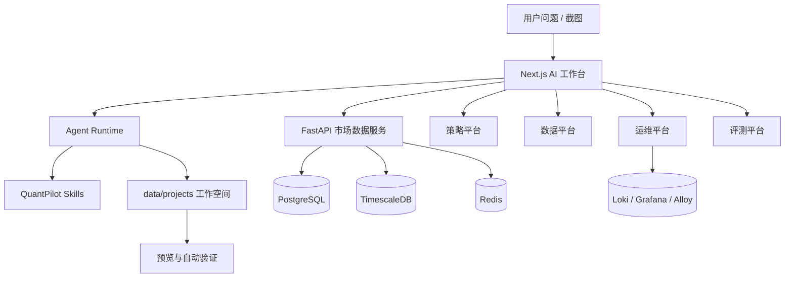

# QuantPilot 文档总览

这个目录保存 QuantPilot 的项目知识。根目录 README 只做入口，长期规则、架构设计、教学材料、数据源口径和排障经验都应沉淀到这里。

读文档时可以把这里当成项目里的“第二位同事”：它不会替你写代码，但应该能告诉你为什么这么设计、该从哪里看、出了问题先查哪一层。如果某篇文档只剩命令和表格，没有解释背景，那它还没写完。

## 先读哪几篇

| 目标 | 文档 |
| --- | --- |
| 想建立全局学习路线 | [教学 00：项目学习地图](learning/00-project-study-map.md) |
| 想快速跑起来 | [教学 01：本地启动与健康检查](learning/01-quick-start.md) |
| 想理解生成链路 | [教学 02：AI 工作空间生成链路](learning/02-ai-workspace-generation.md) |
| 想理解数据和策略平台 | [教学 03：市场数据与策略平台](learning/03-market-data-and-strategy-platform.md) |
| 想优化生成页面 | [教学 04：Skills 与可视化看板](learning/04-skills-and-visual-dashboard.md) |
| 想做评测和运维 | [教学 05：评测、运维与质量门](learning/05-evaluation-and-operations.md) |
| 想参与开发 | [教学 06：开发者协作手册](learning/06-developer-playbook.md) |
| 想学习怎么写 Skills | [教学 07：Skills 编写与迭代教程](learning/07-skills-authoring.md) |
| 想深入策略平台 | [策略平台使用与设计指南](strategy-platform-guide.md) |
| 想深入运维平台 | [运维平台使用与评分指南](ops-platform-guide.md) |

## 知识地图

| 模块 | 文档 | 关注点 |
| --- | --- | --- |
| 总体架构 | [架构总览](architecture.md) | 主链路、运行时、数据层、控制台和质量门 |
| 内部组件 | [内部组件学习指南](internal-components.md) | 页面、服务、数据、Skills、验证、运维和降级如何协作 |
| 项目结构 | [项目结构与分层边界](project-structure.md) | 前端、后端、量化领域层、脚本和生成工作空间边界 |
| 基础设施 | [基础设施配置](infrastructure.md) | PostgreSQL、TimescaleDB、Redis、Loki/Grafana/Alloy、SQL 初始化和降级模式 |
| 行情数据 | [行情数据源采集知识库](market-data-source-knowledge.md) | 东方财富、Baostock、AKShare、字段口径和补数规则 |
| 策略平台 | [策略平台使用与设计指南](strategy-platform-guide.md) | 股票池、ETF/指数池、策略目录、补数控制和策略数据依赖 |
| 运维平台 | [运维平台使用与评分指南](ops-platform-guide.md) | 工作空间健康、运维评分、日志、降级模式和排查路径 |
| 工作空间契约 | [生成工作空间契约](generated-workspace-contract.md) | run plan、数据文件、证据、验证、视觉检查和修复计划 |
| Skills | [Skills 治理规范](skills-governance.md) / [Skills 教程](learning/07-skills-authoring.md) | skill 元数据、版本、发布、回滚、锁文件和编写方法 |
| 评测 | [Agent 评测指南](evals-guide.md) | 用例、评测集、评测器、队列、运行记录和 CI 门禁 |
| 本地产物 | [本地产物与生成文件边界](local-generated-files.md) | 哪些文件可提交、哪些文件只保留本地 |
| 排障 | [故障排查](troubleshooting.md) | 端口、数据库、生成工作空间、验证和常见失败 |
| 市场数据服务 | [市场数据服务 README](../services/market-data/README.md) | FastAPI 接口、provider、补数端点和后端开发 |
| 文档写作 | [文档写作风格指南](documentation-style-guide.md) | 如何写得准确、可读、少一点机器味 |

## 当前能力分层

## 文档维护规则

- README 只保留定位、启动和导航；复杂知识放到 `docs/`。
- 业务规则先写到对应专题文档，再在教学文档里用步骤串起来。
- 写文档时先讲人能理解的背景，再放命令、表格和路径。不要只堆能力名。
- 修改代码后如果改变了使用方式、排障方式或模块边界，必须同步文档。
- 页面截图放在 `docs/learning/assets/`，命名使用页面或流程含义，例如 `strategy-platform.png`。
- 截图前需要确认页面没有 Next 错误覆盖层、验证失败页、明显横向溢出或加载空白。
- 真实密钥、个人路径、未脱敏日志不要写入文档。
- `data/`、`tmp/`、`.next/`、虚拟环境和生成项目大产物不进入 Git。
