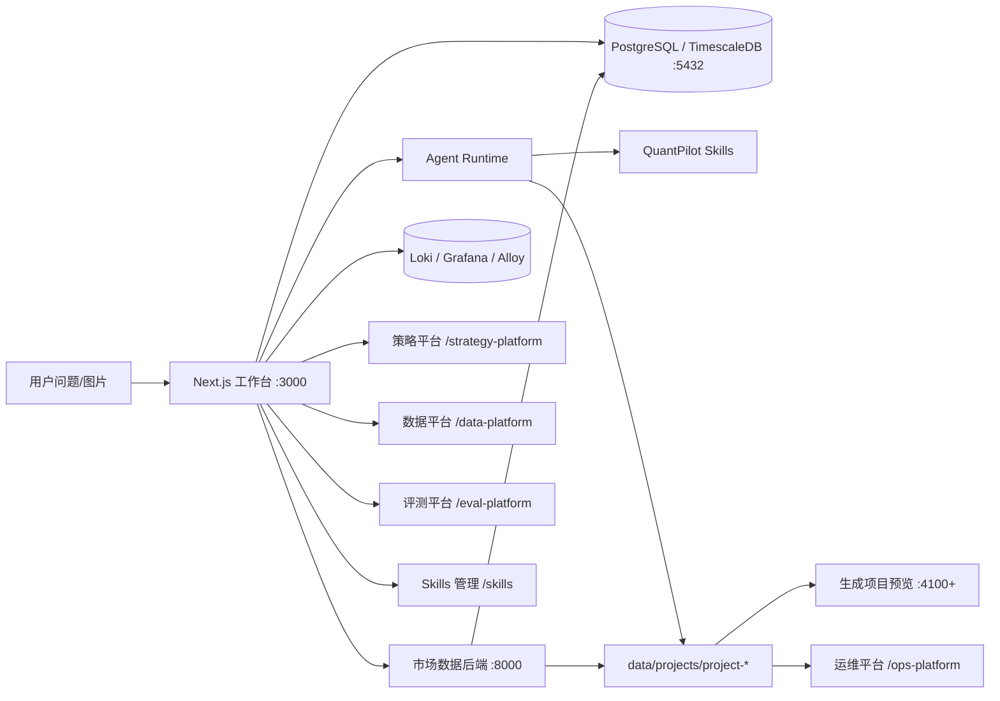

# 架构总览

QuantPilot 的核心链路是：用户提出量化研究问题，主工作台调度 Agent Runtime，Agent 通过核心 skills 规划任务、获取真实数据、生成工作空间，再由平台执行验证、视觉检查、产物契约检查和评测回归。



## 怎么读这张图

这张图可以按四条线来看。

| 线索 | 你要关注什么 |
| --- | --- |
| 用户线 | 用户从首页提出问题，进入项目聊天，再打开生成项目预览 |
| 数据线 | 市场数据后端把外部源采集到 PostgreSQL/TimescaleDB，页面和 Agent 都优先读本地库 |
| 生成线 | Agent Runtime 使用 skills 规划、取数、写页面，并把事件和产物写入 workspace |
| 质量线 | 验证、视觉检查、产物契约、评测和运维共同判断结果是否可交付 |

如果你在排查问题，可以先判断自己站在哪条线上。比如 K 线没有成交额，多半是数据线；页面生成了但很丑，多半是生成线和 skills；预览打不开，多半是生成线、工作空间契约或基础环境；评测失败，多半要沿着质量线回看产物。

## 主链路

1. 用户输入问题，必要时上传截图。
2. Agent 使用 `quant-run-planner` 判断意图是否清晰。
3. 信息不足时进入澄清，用户补充后自动承接上一轮问题。
4. 信息完整后生成 `.quantpilot/run_plan.json`。
5. 平台根据 run plan 调用 `8000` 后端获取真实数据。
6. 数据、来源和质量报告写入工作空间。
7. Agent 使用可视化 skill 生成 Next.js 看板。
8. 平台执行自动验证、产物契约检查和视觉检查。
9. 失败时生成修复计划并触发自动修复。
10. 工作空间健康、生成观测和评测平台提供运行后的治理入口。

## 运行时

| 执行器 | 模型 | 用途 | Reasoning |
| --- | --- | --- | --- |
| `claude` | `MiniMax-M2.7` | 默认分析、默认评测 | 不展示 |
| `codex` | `gpt-5.5` | GPT 兼容链路和对照评测 | 默认 `low` |

模型和 CLI 的注册入口：

- `src/lib/constants/cliModels.ts`
- `src/lib/services/cli/claude.ts`
- `src/lib/services/cli/codex.ts`

## 数据层

后端位于 `services/market-data`，当前默认以东方财富为主数据源，并提供候选免费信源探针。核心响应统一携带：

- `source`
- `asset_type`
- `as_of`
- `fetched_at`
- `fetch`
- `data_quality`

主要接口见 [量化数据后端 README](../services/market-data/README.md)。

本地基础设施默认使用 Docker 中的 PostgreSQL + TimescaleDB + Redis + Loki/Grafana/Alloy：

- PostgreSQL 承载 Prisma 管理的主业务表，包括工作空间、项目、评测、设置和运行记录。
- TimescaleDB 承载 `quant.stock_bars`、`quant.stock_factors`、`quant.strategy_signals` 和 `quant.portfolio_snapshots` 等时序表。
- Redis 承载短期缓存，优先用于板块资金、行情摘要和后续任务进度。
- Loki/Grafana/Alloy 承载集中日志采集和运维排查；Loki 未启动时运维平台会降级读取本地文件日志。
- 行情字段来源、补数优先级和 provider 边界见 [行情数据源采集知识库](market-data-source-knowledge.md)。
- 根目录 `sqls/` 保存组件默认需要的基础 SQL，Docker 首次创建容器时会执行；已有数据库可通过 `npm run db:init` 补齐 SQL 对象并同步 Prisma 应用表。

更多细节见 [基础设施配置](infrastructure.md)。

## 设计取舍

QuantPilot 当前最重要的取舍是“本地事实库优先”。外部接口可以不稳定，也可能字段不完整，但只要数据已经进入本地 TimescaleDB，策略、生成页面和评测都应该优先复用同一份事实。

| 取舍 | 原因 |
| --- | --- |
| PostgreSQL + TimescaleDB 作为核心底座 | 应用状态和时序数据都能在同一个 PostgreSQL 连接体系下管理 |
| 文件系统继续保存 workspace 原件 | 生成项目源码、截图和大 JSON 适合保留原始文件，数据库保存索引和摘要 |
| Redis 先做短期缓存 | 股票池摘要、板块资金和任务进度适合缓存，但长期结果仍写回数据库 |
| Loki 可选但推荐 | 本地开发可以降级到文件日志，排复杂问题时集中日志更省时间 |
| Skills 作为生成规则层 | 同类页面问题不应每次只修代码，要沉淀成下一次生成能复用的规则 |

这个架构允许组件分阶段增强：没有 Loki 时平台还能看本地日志；没有 Redis 时可以直读数据库；没有市场数据后端时部分页面会降级展示注册表。但数据库和生成工作空间契约是核心，一旦缺失就很难保证结果可追溯。

## 工作空间产物

每个生成项目都应形成一组可检查的产物：

- `.quantpilot/run_plan.json`
- `.quantpilot/events.jsonl`
- `.quantpilot/generation-state.json`
- `.quantpilot/generation-queue.json`
- `.quantpilot/validation.json`
- `.quantpilot/validation-repair-plan.json`
- `.quantpilot/artifact-contracts.json`
- `.quantpilot/visual-validation.json`
- `data_file/final/dashboard-data.json`
- `evidence/sources.json`
- `evidence/data_quality.json`

更详细的文件契约见 [生成工作空间契约](generated-workspace-contract.md)。

## 控制台

| 控制台 | 路径 | 责任 |
| --- | --- | --- |
| 首页工作台 | `/` | 创建任务、进入项目、管理主工作流 |
| Skills 管理 | `/skills` | 编辑、发布、回滚和导入核心 skills |
| 策略平台 | `/strategy-platform` | 管理股票池、ETF/指数池、策略模板、板块资金、基础组件、金融知识、扫描队列和回测入口 |
| 数据平台 | `/data-platform` | 查看能力域、数据接口、产物契约和验证规则 |
| 运维平台 | `/ops-platform` | 查看 workspace 健康、生成链路状态、队列、阶段事件、产物、trace 和集中日志 |
| 评测平台 | `/eval-platform` | 管理用例、评测集、运行队列、报告和失败修复 |

项目目录和分层边界见 [项目结构与分层边界](project-structure.md)。

## 构建与开发模式

主应用通过脚本统一启动和构建：

- `scripts/dev/run-web.js`：开发服务、端口管理、环境初始化、数据库检查、稳定 CSS 生成。
- `scripts/build/run-build.js`：生产构建，构建前会停止根项目 `3000` 开发服务。

当前主应用默认走 Rspack 接入；如果检测到 Rspack 开发缓存异常，启动脚本会自动切换到 Next Turbopack 稳定模式。需要手动诊断时可以临时设置：

```bash
QUANTPILOT_BUNDLER=turbo npm run dev
```

`npm run build` 默认跳过服务端 route 的 per-route output tracing，避免在 `.git`、`.next`、`data/projects` 等目录上做耗时追踪。需要完整 standalone 输出时使用：

```bash
npm run build:standalone
```

## 质量门

GitHub Actions 当前包含：

- 前端：`npm ci`、`npm run lint`、`npm run type-check`、`npm run build`。
- 后端：`uv sync --locked --all-groups`、`uv run ruff check .`、`uv run pytest`。

Dependabot 每周检查：

- 根目录 npm 依赖。
- `services/market-data` uv 依赖。
- GitHub Actions。
