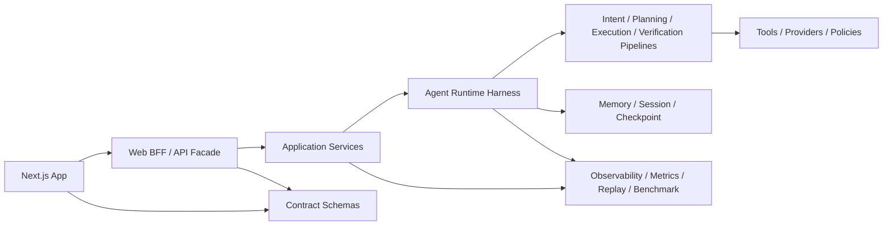

# Harness Engineering 整体重构优化设计

## 1. 背景与设计视角

本文把 `harness engineer` 理解为一类偏平台和执行框架的工程视角:

- 不只关注“功能能跑”
- 更关注“主链路是否稳定、边界是否清晰、契约是否收敛、改动是否可验证、上线是否可观测”

moyuan-travel-agent 当前已经具备不错的三层结构雏形:

- `frontend/`: Next.js 交互层
- `web/moyuan_web/`: FastAPI 服务层
- `agent/travel_agent/`: Agent 运行时与推理层

同时，仓库也已经明显进入“从可用走向可维护”的阶段。现阶段最需要的，不是再加一轮零散功能，而是把已有能力整理成一套更稳定的执行底座。

## 2. 现状诊断

### 2.1 已经做对的部分

- 系统已经形成 `Frontend -> Web API -> AgentRuntime -> Graph/Subagents` 的主链路。
- 已有 `startup checks`、`/api/ready`、`/api/metrics`、SSE trace、benchmark、golden eval、quality gate。
- Agent 侧已经开始从单图演进到 `runtime / supervisor / subagents / skills / artifacts` 的更清晰结构。
- 文档体系相对完整，`README`、`docs/README.md`、`docs/reference/*`、`docs/architecture/*` 已具备维护基础。

### 2.2 主要结构性问题

#### A. 前端“页面组件化”过强，“领域模块化”不足

当前几个核心文件已经承担了过多职责:

- `frontend/src/components/ChatArea.tsx`: 987 行
- `frontend/src/components/MessageList.tsx`: 1157 行
- `frontend/src/components/TravelPlanToolkit.tsx`: 930 行
- `frontend/src/components/CityExplorer.tsx`: 837 行
- `frontend/src/services/api.ts`: 523 行

这些文件同时混合了:

- 页面状态
- SSE 流解析
- 视图逻辑
- 交互编排
- 文本加工
- 导出分享
- 运行时日志展示

结果是:

- 单文件改动半径大
- 组件测试粒度偏粗
- 复用困难
- 新人理解成本高

#### B. Web API 仍然偏“胖服务 + 路由内 DTO”

当前关键服务文件体量较大:

- `web/moyuan_web/services/chat_service.py`: 1237 行
- `web/moyuan_web/services/city_service.py`: 617 行

同时，接口契约大多以内联 `BaseModel` 形式分散在 `routes/*.py` 中。这样会导致:

- 路由层兼顾协议定义和业务编排
- DTO 复用困难
- 前后端契约难以集中演进
- OpenAPI 有了，但“契约成为代码中心”的效果还不够强

#### C. Agent 图层承担了过多策略、执行、验证、兜底责任

当前 Agent 核心文件体量已经超过“可持续维护”的舒适区:

- `agent/travel_agent/graph/nodes.py`: 3300 行
- `agent/travel_agent/graph/memory_integration.py`: 2688 行
- `agent/travel_agent/graph/builder.py`: 837 行

`nodes.py` 中同时容纳了:

- intent 识别
- strategy 决策
- plan 生成与校验
- execute 调度
- tool retry / timeout / circuit
- verify
- answer
- self check
- tool result ranking / fusion / normalization
- 高风险保护

这会让后续每一次 Agent 迭代都变成高风险手术。

#### D. 包边界仍然依赖路径注入，模块自治性不足

当前仓库同时存在:

- 根目录 `requirements.txt` / `requirements-dev.txt`
- `agent/pyproject.toml`
- `web/pyproject.toml`
- `ensure_project_paths()` / `sys.path.insert(...)`

并且多个脚本与服务仍依赖手工路径注入来导入 `agent`、`config`、`web`。这说明当前是“逻辑分层已有，打包边界未收口”的状态。

直接影响是:

- 本地运行依赖隐式路径约定
- CI/脚本/容器入口容易各自维护一套导入方式
- 长期不利于模块拆分与复用

#### E. 前后端契约是“手工同步”，不是“单一真相源”

例如:

- 前端类型集中在 `frontend/src/types/index.ts`
- 后端请求/响应模型散落在 `web/moyuan_web/routes/*.py`

现在契约虽然有快照，但仍然主要靠人工保持一致。随着 `artifact`、`subagent`、`health diagnostics`、`SSE event` 持续扩展，手工同步的成本会越来越高。

#### F. 工程治理存在“覆盖不均匀”的问题

当前治理已经不错，但仍有几个明显缺口:

- `ruff.toml` 直接排除了整个 `frontend`
- CI 中 `ruff` / `mypy` 只检查显式列出的少量 Python 文件，不包含 `chat_service.py`、`city_service.py`、`graph/nodes.py`、`graph/memory_integration.py`
- 前端单测目前只有少量核心点，组件层仅见 `MessageList.test.tsx`
- `frontend/tests/unit/stores/chatStore.test.ts` 的实际内容是 logger 测试，说明测试目录命名已出现漂移

#### G. 可读性被“模板化 docstring”侵蚀

仓库中包含大量重复的 `Purpose:` 风格 docstring:

- `web/` 中约 89 处
- `agent/` 中约 206 处

而 `scripts/docstring_audit.py` 当前只审查“是否存在 docstring”，不会衡量是否有信息量。这会自然诱导出“为通过审计而补模板”的行为，最终降低代码的有效可读性。

## 3. 重构目标

本轮整体重构的目标不是重写，而是让项目具备以下能力:

1. 主链路稳定
   前端、API、Agent 的调用链有明确边界，改动可控。
2. 契约单一真相源
   API 与 SSE 模型不再靠手工双写维护。
3. Agent 可分段演进
   intent、planning、execution、verification、answer 可以独立优化。
4. 工程治理覆盖关键复杂度区域
   最大文件、核心运行时、SSE 契约、前端大组件全部进入检查范围。
5. 重构过程渐进可回退
   优先模块抽离与兼容层，不做一次性大爆破。

## 4. 设计原则

- 契约优先: 先收口输入输出，再拆内部实现。
- 运行时优先: 先保护 `chat stream` 主链路，再做局部重构。
- 分层清晰: Router 不写业务，Service 不堆协议，Runtime 不直接背所有策略细节。
- 小步迁移: 兼容旧接口，逐步替换内部模块。
- 观测先行: 每个阶段都必须可测、可追踪、可比较。

## 5. 目标架构

### 5.1 总体目标图



### 5.2 前端目标结构

建议从“按组件堆叠”转为“按领域切片”:

```text
frontend/src/
├── app/
├── features/
│   ├── chat/
│   │   ├── components/
│   │   ├── hooks/
│   │   ├── store/
│   │   └── stream/
│   ├── trip-plan/
│   ├── city-explorer/
│   ├── session/
│   └── system-status/
├── shared/
│   ├── api/
│   ├── contracts/
│   ├── ui/
│   └── utils/
└── types/
```

具体收口建议:

- 把 `ChatArea.tsx` 拆成:
  - `useChatStream`
  - `useChatComposer`
  - `ChatRuntimePanel`
  - `ChatConstraintBar`
  - `ChatInputBox`
- 把 `MessageList.tsx` 拆成:
  - markdown normalize
  - think block parser
  - export/share actions
  - message item renderer
- 把 `api.ts` 拆成:
  - `rest-client.ts`
  - `stream-client.ts`
  - `trace.ts`
  - `endpoints/*.ts`
- 统一 `API_BASE` 解析策略，消除 `AppContext.tsx` 与 `api.ts` 的双轨配置。

状态管理建议:

- UI 局部状态继续留在组件或 hook
- 跨页面/跨组件会话状态收敛到 store
- 流式运行时状态单独建流式 store，不与消息持久态混在一起

### 5.3 Web API 目标结构

建议从当前的 `routes + services + repositories + storage` 演进为更明确的四层:

```text
web/moyuan_web/
├── api/
│   ├── routes/
│   ├── schemas/
│   └── errors/
├── application/
│   ├── chat/
│   ├── session/
│   ├── city/
│   ├── share/
│   └── map/
├── domain/
│   ├── session/
│   ├── share/
│   └── city/
├── infrastructure/
│   ├── repositories/
│   ├── storage/
│   ├── config/
│   └── observability/
└── bootstrap/
```

拆分重点:

- `routes/*.py` 只负责 HTTP 协议与错误码映射
- 所有 `BaseModel` 迁移到 `api/schemas/`
- `chat_service.py` 拆成:
  - `chat_stream_service.py`
  - `chat_history_service.py`
  - `chat_health_service.py`
  - `chat_metrics.py`
- `city_service.py` 拆成:
  - `city_catalog_service.py`
  - `city_recommendation_service.py`
  - `city_mapper.py`

依赖注入建议:

- 保留当前轻量容器思路
- 但把“全局单例 + provider 函数”收敛到 bootstrap 层
- 业务层不再感知容器

### 5.4 Agent 目标结构

Agent 侧应从“超大节点文件”演进到“编排层 + 阶段模块 + 策略模块”。

建议结构:

```text
agent/travel_agent/
├── runtime/
│   ├── agent_runtime.py
│   ├── stream_adapter.py
│   └── diagnostics.py
├── orchestration/
│   ├── graph_builder.py
│   ├── stage_router.py
│   └── event_stream.py
├── stages/
│   ├── intent.py
│   ├── planning.py
│   ├── execution.py
│   ├── verification.py
│   ├── answering.py
│   └── self_check.py
├── policies/
│   ├── tool_policy.py
│   ├── retry_policy.py
│   ├── timeout_policy.py
│   ├── safety_policy.py
│   └── freshness_policy.py
├── memory/
│   ├── manager.py
│   ├── summarizer.py
│   ├── injector.py
│   └── checkpoint_store.py
├── artifacts/
├── skills/
├── subagents/
└── tools/
```

核心思想:

- `runtime` 负责给 Web 提供稳定入口
- `orchestration` 负责图构建和事件流兼容
- `stages` 只负责某一阶段的纯业务逻辑
- `policies` 抽离重试、超时、熔断、高风险保护等横切逻辑
- `memory` 从 `graph/memory_integration.py` 中独立出来，避免记忆逻辑继续膨胀

这样可以把当前 `nodes.py` 中的复杂度拆散成数个可单测、可替换的模块。

### 5.5 契约与共享模型

建议建立“单一真相源”的契约层，至少覆盖:

- REST request/response
- SSE event payload
- artifact schema
- health diagnostics schema

落地方式建议二选一:

#### 方案 A: 以后端 schema 为源，前端自动生成类型

- 后端集中定义 `api/schemas/*`
- 通过 OpenAPI 或单独的 JSON Schema 导出前端类型
- 前端 `src/types` 仅保留 UI 组合型类型

#### 方案 B: 新建 `shared-contracts/` 模块

- 对 REST/SSE/artifact 建独立 schema
- Web 与 Frontend 同时消费
- AgentRuntime 也直接依赖这套 schema

对当前项目而言，推荐优先使用方案 A，成本最低，也更贴合已有 OpenAPI/SSE 快照体系。

### 5.6 配置与打包边界

建议把仓库从“逻辑分层”升级为“逻辑分层 + 打包分层”:

- 根目录统一 Python 工程入口
- `agent` 与 `web` 作为明确子包
- 逐步移除 `ensure_project_paths()` 与脚本里的 `sys.path.insert(...)`

建议目标:

- 用单一 `pyproject.toml` 或明确 workspace 管理 Python 依赖
- `scripts/` 通过标准包导入运行
- CI、容器、本地命令共享同一套导入模型

### 5.7 工程治理与质量门禁

#### Python

- `ruff` 和 `mypy` 不再只检查白名单文件，而是覆盖 `agent/`、`web/`、`scripts/`
- 对复杂模块增加文件级规则:
  - 单文件建议不超过 500 行
  - 超过阈值必须拆分或记录 ADR

#### Frontend

- 增加 ESLint
- 补齐 `ChatArea`、`TravelPlanToolkit`、`CityExplorer`、`api stream client` 的单测
- 把关键交互补到 Playwright 冒烟里:
  - 建会话
  - SSE 流式问答
  - 分享链接
  - 城市筛选

#### 文档治理

- `docstring_audit.py` 从“只看有没有”升级为“只要求公共模块和公开对象”
- 对内部私有函数取消一刀切要求
- 减少模板化 `Purpose:` 文本，把设计说明迁回架构文档与模块 README

## 6. 分阶段实施路线

### Phase 0: 基线冻结

目标: 在开始拆分前先锁定现状。

- 冻结当前 OpenAPI / SSE / benchmark / golden 基线
- 记录大文件清单与复杂度清单
- 为关键重构建立 ADR

产出:

- 重构任务看板
- 风险矩阵
- 回归清单

### Phase 1: 契约和入口收口

目标: 先让边界稳定。

- 新增 `web/moyuan_web/api/schemas/`
- 把 route 内联 `BaseModel` 迁出
- 统一 `frontend` 的 API base 与 trace headers 入口
- 明确 `StreamMetadata` / `SubagentEvent` / `ArtifactPatch` 契约来源

验收标准:

- 前后端契约定义位置统一
- OpenAPI/SSE 快照与类型生成链路打通
- 不改变现有 API 行为

### Phase 2: Web 服务拆分

目标: 把胖服务拆成可维护模块。

- 拆 `chat_service.py`
- 拆 `city_service.py`
- 容器注册迁移到 bootstrap
- 让路由层只做协议映射

验收标准:

- `chat_service.py` 不再是单文件入口总控
- 每个 service 文件职责单一
- 现有测试继续通过

### Phase 3: 前端领域化重构

目标: 把 UI 大组件拆成领域模块。

- 引入 `features/chat`、`features/trip-plan`、`features/city-explorer`
- 抽离 `useChatStream`
- 抽离 markdown/导出/分享逻辑
- 建立流式状态 store

验收标准:

- `ChatArea.tsx`、`MessageList.tsx` 降到 300 行级别
- 流式解析与 UI 渲染分离
- 前端关键路径有单测覆盖

### Phase 4: Agent 可演进化改造

目标: 拆解大图节点，保留兼容入口。

- 拆 `nodes.py` 为 `stages/* + policies/*`
- 拆 `memory_integration.py` 为 `memory/*`
- `builder.py` 只负责装配，不再承担策略
- 保持 `AgentRuntime` 作为对 Web 的稳定 facade

验收标准:

- intent / planning / execution / verification 独立可测
- tool policy、retry、timeout、safety 不再混在节点实现中
- replay、benchmark、diagnostics 可以直接定位到阶段模块

### Phase 5: 平台化治理补齐

目标: 让架构改造形成长期机制。

- 扩大静态检查覆盖
- 增加前端 E2E
- 增加复杂文件阈值检查
- 增加契约生成和 drift 检查

验收标准:

- CI 对复杂区域真正有约束力
- 新增功能不再轻易把复杂度打回单文件

## 7. 第一批推荐落地项

如果只做第一轮，我建议优先做下面 10 项:

1. 新增 `web/moyuan_web/api/schemas/`，迁出所有 route DTO。
2. 统一前端 `API_BASE` 解析逻辑，只保留一套来源。
3. 把 `frontend/src/services/api.ts` 拆成 REST client 与 SSE client。
4. 为 `ChatArea` 抽出 `useChatStream`。
5. 为 `MessageList` 抽出 markdown 预处理与导出模块。
6. 把 `chat_service.py` 拆为 stream、history、health、metrics 四个服务。
7. 把 `graph/nodes.py` 先拆出 `execution.py` 与 `verification.py`。
8. 把 `graph/memory_integration.py` 先拆出 `memory/manager.py`。
9. 让 `ruff` / `mypy` 覆盖 `chat_service.py` 与 `agent/travel_agent/graph/*`。
10. 调整 `docstring_audit.py` 规则，减少模板化 docstring。

## 8. 关键风险与规避方式

### 风险 1: 一次性拆太多导致主链路失稳

规避:

- 每阶段只动一个主轴
- 保留兼容 facade
- SSE 契约优先做快照回归

### 风险 2: 前后端类型在迁移期双轨维护更混乱

规避:

- 先定“哪个是源”
- 在第一阶段就建立生成链路
- 迁移期禁止再新增第三套类型定义

### 风险 3: Agent 重构影响质量评估口径

规避:

- benchmark / golden / replay 三套基线必须先冻结
- 每次拆分都保留前后对比报表

## 9. 目标衡量指标

重构完成后，建议至少达到以下指标:

- 前端核心组件文件控制在 300 行级别
- Python 核心服务和阶段文件控制在 400-500 行级别
- REST/SSE/artifact 契约有单一真相源
- 静态检查覆盖 `agent/`、`web/`、`scripts/` 主体代码
- 前端关键交互具备单测与 E2E 冒烟
- benchmark / golden / replay 成为 Agent 重构的发布门禁

## 10. 结论

这个项目现在最适合走的路线，不是“重写一版更漂亮的架构”，而是:

- 先收口契约
- 再拆服务与大组件
- 再拆 Agent 大节点
- 最后把治理规则补成平台能力

从 Harness Engineering 的角度看，moyuan-travel-agent 下一阶段最关键的不是再堆更多功能，而是把已经形成雏形的三层系统，升级成一个真正可持续演进的执行底座。
