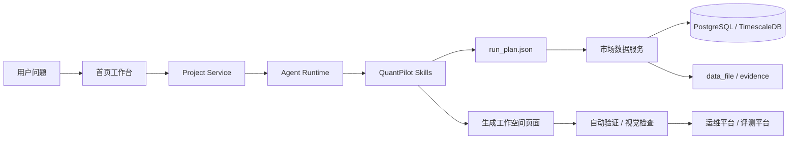

# 内部组件学习指南

这篇文档解释 QuantPilot 内部组件如何协作。它介于“架构总览”和“代码细节”之间：不只画框图，也说明每个组件在什么场景下被调用、依赖什么、失败后如何降级。

读它时可以想象一次真实请求：用户问一个股票问题，页面要创建项目，Agent 要规划，后端要取数，数据库要保存，skill 要生成页面，验证器要检查，运维平台要告诉我们哪里出错。下面这些组件就是这条路上的不同岗位。

## 组件地图

| 组件 | 代码位置 | 主要责任 |
| --- | --- | --- |
| Next.js 主应用 | `src/app/` | 页面、API route、控制台入口 |
| 前端组件层 | `src/components/` | 聊天、任务、设置、UI 原语和业务组件 |
| 主业务服务层 | `src/lib/services/` | 项目、消息、设置、预览、CLI runtime 和外部服务连接 |
| 量化领域层 | `src/lib/quant/` | 策略、评测、能力中心、工作空间健康、生成验证和 Skills 数据 |
| 运维领域层 | `src/lib/ops/` | 基础环境健康、日志、Docker/数据库/Loki 状态 |
| 数据库入口 | `src/lib/db/`、`prisma/` | Prisma 管理的主业务表 |
| 市场数据服务 | `services/market-data/` | 行情、K 线、财务、公告、补数、基础组件和回测 API |
| SQL 初始化 | `sqls/` | `quant` schema、TimescaleDB hypertable、股票池和基础组件表 |
| Skills 源码 | `.claude/skills/` | Agent 的本地能力包、领域规则和生成约束 |
| 生成工作空间 | `data/projects/` | 每个 AI 生成项目的源码、数据、证据和验证报告 |
| 本地基础设施 | `docker-compose.yml`、`deploy/observability/` | TimescaleDB、Redis、Loki、Grafana 和 Alloy |
| 脚本 | `scripts/` | 启动、构建、检查、数据库迁移、评测和 skill 打包 |

## 一次用户请求如何流动



这个链路里最重要的边界是：Agent 负责规划和生成，市场数据服务负责取数和入库，验证器负责判断结果是否可用。不要让一个组件承担所有责任。边界清楚，排障才不会乱。

## 主应用组件

Next.js 主应用包含页面和 API route。页面只负责组织 UI 和交互，复杂业务逻辑应放到 `src/lib/*`。

| 页面 | 路径 | 学习重点 |
| --- | --- | --- |
| 首页工作台 | `/` | 任务创建、模型选择、项目入口、全局设置 |
| 项目聊天 | `/project-id/chat` | SSE 消息、Agent 状态、预览、验证错误展示 |
| 策略平台 | `/strategy-platform` | 股票池分页、K 线详情、补数弹窗、策略目录、基础组件 |
| 数据平台 | `/data-platform` | 能力域、数据源注册表、契约和降级状态 |
| 运维平台 | `/ops-platform` | 工作空间健康、基础环境、日志和生成观测 |
| 评测平台 | `/eval-platform` | 用例、评测集、队列、运行记录和失败修复 |
| Skills 管理 | `/skills` | skill 编辑、发布、打包、回滚和状态检查 |

开发时如果发现页面文件过重，优先拆到同目录 `*Client.tsx` 或 `src/components/`，不要把后端查询、文件扫描和复杂计算塞进 JSX。

一个简单判断：如果代码是在处理“点了按钮以后显示什么”，它大概率属于组件；如果代码是在回答“这个业务状态怎么算”，它应该下沉到 `src/lib/*`。

## 数据组件

QuantPilot 的数据层分三类：

| 数据 | 存储 | 原因 |
| --- | --- | --- |
| 项目、消息、设置、评测状态 | PostgreSQL + Prisma | 关系型状态、事务和索引 |
| K 线、因子、信号、组合净值 | TimescaleDB `quant` schema | 时序数据量大，需要按时间查询 |
| 日志、截图、大 JSON、生成源码 | 文件系统 / Loki | 原始产物大，数据库只保存索引和摘要 |

Redis 是短期缓存，不是事实库。缓存丢了不应该影响长期研究结果，只会影响速度或进度展示。

这条边界很重要。缓存可以让页面更快，但不能让研究结果只存在缓存里。凡是会影响回测、选股、指标解释的数据，都应该最终落到 PostgreSQL/TimescaleDB 或可追溯文件里。

## 市场数据服务组件

`services/market-data` 是独立 FastAPI 服务。它的主要模块如下：

| 文件或目录 | 作用 |
| --- | --- |
| `api.py` | HTTP 路由，负责请求解析和响应模型 |
| `database.py` | TimescaleDB 查询、入库、股票池分页、补数任务和基础组件 |
| `models.py` | Pydantic 响应模型和请求模型 |
| `providers/eastmoney.py` | 东方财富实时行情、历史 K 线、财务和公告 |
| `providers/baostock.py` | A 股日线增强字段补数 |
| `providers/akshare.py` | AKShare 补充聚合层 |
| `cache.py` | 本地 JSON 缓存和 Redis 短期缓存 |

市场数据服务的原则是：外部源只作为采集入口，本地 TimescaleDB 才是策略研究优先读取的事实库。

这也是为什么我们会关心补数、字段口径和数据质量。外部接口今天能通，不代表明天字段不会变；本地库和 evidence 才能让一次研究可复盘。

## Skills 组件

Skills 是 Agent 的项目内能力手册。它们不是简单提示词，而是包含执行顺序、数据契约、禁止事项和修复策略。

| Skill 类型 | 例子 | 作用 |
| --- | --- | --- |
| 规划 | `quant-run-planner` | 把自然语言问题转成 run plan |
| 数据 | `quant-market-data`、`quant-fundamentals` | 获取行情、财务、公告和指标 |
| 质量 | `quant-data-quality` | 记录来源、缺失字段和风险 |
| 可视化 | `quant-visualization-html`、`quantpilot-ui-product-design` | 生成金融看板并修复布局问题 |
| 回测 | `quant-backtest` | 管理策略参数、回测结果和限制说明 |

学习 Skills 的详细教程见 [07. Skills 编写与迭代教程](learning/07-skills-authoring.md)。

## 验证和评测组件

验证和评测解决的是“生成结果是否真的可用”：

| 组件 | 位置 | 关注点 |
| --- | --- | --- |
| 自动验证 | `src/lib/quant/validation.ts` | build、HTTP、数据文件、证据和 stale report |
| 产物契约 | `src/lib/quant/artifact-contracts.ts` | 禁止远程资源、mock 数据和敏感信息 |
| 视觉验证 | `src/lib/quant/visual-validation.ts` | 错误页、空白页、横向溢出和图表可读性 |
| 评测平台 | `src/lib/quant/evals.ts` | 用例、评测集、队列、报告和修复单 |

如果一个生成页面失败，先看验证报告，再看页面截图，最后才决定改 skill、改数据或改平台代码。

很多时候，验证报告比肉眼更诚实。它会告诉你 final data 是否真的存在、页面是否真的消费了数据、有没有远程资源、有没有 mock 数据。先看报告，能少猜很多。

## 降级组件

降级配置位于 `src/lib/config/degradation.ts`，对应 `.env` 中的：

```env
QUANTPILOT_DEGRADATION_MODE=auto
QUANTPILOT_DATABASE_ENABLED=1
QUANTPILOT_MARKET_API_ENABLED=1
QUANTPILOT_OBSERVABILITY_ENABLED=1
QUANTPILOT_REDIS_CACHE_ENABLED=1
```

三种模式：

| 模式 | 适合场景 | 行为 |
| --- | --- | --- |
| `auto` | 本地开发 | 可选组件缺失时 warning，并使用兜底数据 |
| `strict` | CI、生产巡检 | 必需组件缺失时失败 |
| `offline` | 离线看页面或写文档 | 跳过可选外部探测，优先本地文件和内置注册表 |

新增组件时要同时考虑：它是否必须存在，缺失时怎么降级，doctor 和运维平台如何展示。

## 如何定位一个需求

| 需求 | 优先改哪里 | 同步文档 |
| --- | --- | --- |
| 股票池增加字段 | `services/market-data/database.py`、`src/lib/quant/strategies.ts`、策略平台客户端 | `docs/learning/03`、市场数据 README |
| 新增数据源 | provider、注册表、数据质量、候选探针 | `docs/market-data-source-knowledge.md` |
| 页面生成反复不好看 | `.claude/skills/quant-visualization-html` 或 UI skill | `docs/learning/04`、`docs/skills-governance.md` |
| 新增基础设施组件 | `docker-compose.yml`、`.env.example`、doctor、运维平台 | `docs/infrastructure.md`、`docs/troubleshooting.md` |
| 新增评测能力 | `src/lib/quant/evals.ts`、评测平台页面 | `docs/evals-guide.md` |
| 生成工作空间文件变化 | scaffold、validation、artifact contracts | `docs/generated-workspace-contract.md` |

## 组件学习实验

建议做三个小实验来串起来：

1. 在策略平台点开一只股票，观察前端请求、`src/lib/quant/strategies.ts` 映射和后端 `/api/v1/research/bars/{symbol}`。
2. 在 `/skills` 打开 `quant-visualization-html`，对照一个生成工作空间的 `app/page.tsx`，理解 skill 如何约束页面质量。
3. 停掉 Loki 后运行 `npm run doctor`，再打开运维平台，观察降级模式如何从集中日志切到本地日志。

做完这三步，基本就能理解 QuantPilot 的组件协作方式。
