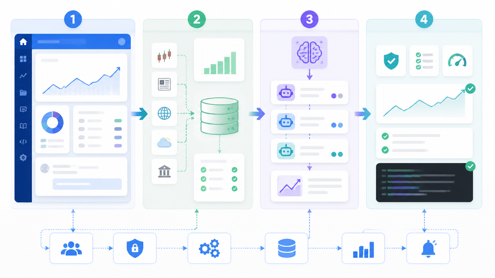

# 00. 项目学习地图

目标：建立 QuantPilot 的整体心智模型，知道先学什么、从哪里读代码、怎样把一个需求定位到对应模块。

这篇适合第一次接触项目时阅读。读完后不一定会改所有代码，但应该能判断一个问题属于前端、后端、数据、Skills、评测还是基础设施。

先放轻松一点。QuantPilot 看起来模块很多，第一次看会有点像走进一间工具很多的工作室。你不需要马上知道每把工具怎么用，先知道哪张桌子上放着什么就够了。

这张图用 gpt-image2 生成，用来帮你先建立“产品、数据、生成、质量”四条主线的直觉。图里的数字只是学习顺序提示，具体术语以正文为准。

## 先建立四条主线

QuantPilot 可以理解成四条主线叠在一起：

| 主线 | 解决什么问题 | 关键入口 |
| --- | --- | --- |
| 产品主线 | 用户在哪里提问、看项目、管理平台能力 | `src/app/page.tsx`、`src/app/*/*Client.tsx` |
| 数据主线 | 行情、K 线、因子、股票池和补数如何进入本地库 | `services/market-data/`、`sqls/` |
| 生成主线 | 用户问题如何变成工作空间、页面和证据文件 | `.claude/skills/`、`src/lib/quant/validation.ts` |
| 质量主线 | 如何判断页面真的可用，失败后如何修复 | `docs/evals-guide.md`、`src/lib/quant/evals.ts`、`src/lib/ops/` |

学习时不要一开始就陷进某个组件。先判断当前任务属于哪条主线，再顺着链路阅读。很多问题看起来是页面问题，真正原因可能是数据缺字段；也有些看起来像数据问题，最后发现是 skill 把多标的任务生成成了单股模板。

## 一小时学习路线

如果只有一小时，按这个顺序看：

1. [README](../../README.md)：知道项目能做什么、怎么启动。
2. [架构总览](../architecture.md)：看懂主链路和几个控制台。
3. [项目结构与分层边界](../project-structure.md)：知道代码放哪里。
4. [本地启动与健康检查](01-quick-start.md)：理解本地依赖和诊断命令。
5. [内部组件学习指南](../internal-components.md)：把组件和代码目录对应起来。

这一轮的目标不是记住所有细节，而是能回答：“我现在要改的东西，大概在哪一层？”有了这个判断，后面就不会在错误的目录里来回翻。

## 一天学习路线

如果准备真正参与开发，建议按任务类型做三次小练习：

| 练习 | 要做什么 | 会学到什么 |
| --- | --- | --- |
| 打开策略平台并点一只股票 | 看股票池、K 线详情、补数入口和基础组件页 | 股票池、K 线、因子、补数和数据质量 |
| 打开一个生成工作空间 | 看 `.quantpilot`、`data_file`、`evidence` 和验证报告 | run plan、final data、证据和验证 |
| 打开 Skills 管理 | 看核心 skill、版本、文件数和发布流程 | skill 边界、打包、lock 和 changelog |

每个练习都建议同时打开页面和代码。页面建立直觉，代码确认真实实现。

别只读文档。这个项目很多能力是“页面、后端、SQL、skill、验证”连在一起的，光看其中一段很容易误解。比如股票池里的一个字段，可能同时涉及 SQL 列、Python 映射、TypeScript 类型和前端展示。

## 一周学习路线

一周内可以按能力域深入：

| 天数 | 学习重点 | 推荐文档 |
| --- | --- | --- |
| 第 1 天 | 本地启动、项目结构、基础设施 | `01`、[基础设施配置](../infrastructure.md) |
| 第 2 天 | 市场数据、股票池、补数和策略平台 | `03`、[行情数据源采集知识库](../market-data-source-knowledge.md) |
| 第 3 天 | AI 工作空间生成链路 | `02`、[生成工作空间契约](../generated-workspace-contract.md) |
| 第 4 天 | Skills 和可视化页面质量 | `04`、`07`、[Skills 治理规范](../skills-governance.md) |
| 第 5 天 | 评测、运维、日志和质量门 | `05`、[Agent 评测指南](../evals-guide.md) |
| 第 6 天 | 开发者协作、代码边界和提交前检查 | `06`、[本地产物边界](../local-generated-files.md) |
| 第 7 天 | 选择一个真实小需求完整走一遍 | 从页面到代码到验证 |

## 读代码的顺序

不同问题有不同入口：

| 想理解 | 从这里开始 | 然后看 |
| --- | --- | --- |
| 首页任务怎么创建 | `src/app/page.tsx` | `src/components/task/`、`src/lib/services/project.ts` |
| 项目聊天怎么运行 Agent | `src/app/[project_id]/chat/` | `src/lib/services/cli/`、`src/lib/quant/workspace.ts` |
| 策略平台怎么取数据 | `src/app/strategy-platform/StrategyPlatformClient.tsx` | `src/lib/quant/strategies.ts`、`services/market-data/` |
| 市场数据怎么入库 | `services/market-data/src/quantpilot_market_data/api.py` | `database.py`、`providers/`、`sqls/` |
| Skills 怎么安装到工作空间 | `src/lib/utils/scaffold.ts` | `.claude/skills.registry.json`、`scripts/skills/` |
| 验证怎么判断失败 | `src/lib/quant/validation.ts` | `artifact-contracts.ts`、`visual-validation.ts` |
| 运维平台怎么聚合健康 | `src/app/ops-platform/` | `src/lib/ops/`、`src/lib/quant/workspace-health.ts` |

## 学习时的判断口诀

1. 页面不好看，先判断是数据缺失、组件布局还是 skill 规则缺失。
2. 数据缺字段，先判断本地库有没有，再判断 provider 是否能补。
3. 生成失败，先看 validation，再看 repair plan，不要只看聊天记录。
4. 组件不可用，先看 `npm run doctor`，再看降级模式。
5. 想长期修复，优先改平台能力、skill 或数据链路，不要只修某个生成工作空间。

## 如果你迷路了

最常见的迷路方式，是同时打开太多文件，然后每个文件都像“可能有关”。这时候先停一下，问三个问题：

1. 用户看到的问题发生在哪个页面？
2. 这个页面的数据来自本地状态、市场数据后端，还是生成工作空间文件？
3. 如果这是系统性问题，应该沉淀到代码、SQL、skill、评测还是文档？

回答完这三个问题，基本就能把搜索范围缩小一半。

## 下一步

学完本篇后，继续读：

- [01. 本地启动与健康检查](01-quick-start.md)
- [内部组件学习指南](../internal-components.md)
- [07. Skills 编写与迭代教程](07-skills-authoring.md)
