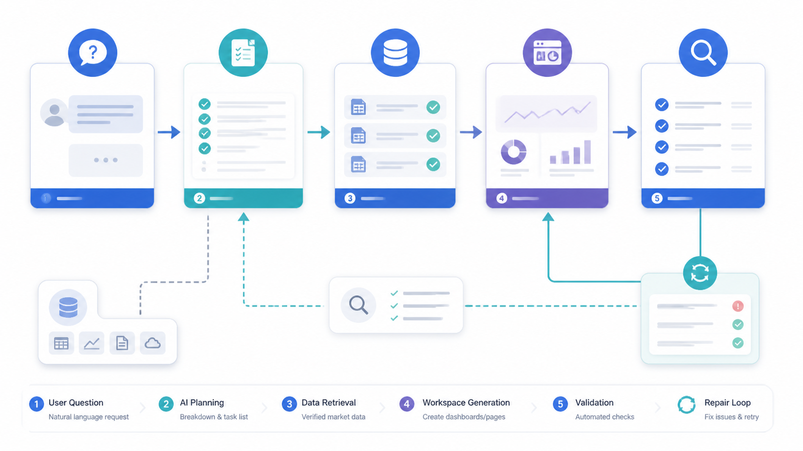
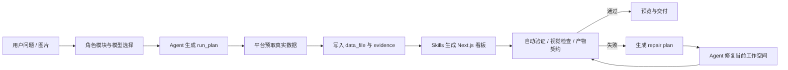

# 02. AI 工作空间生成链路

目标：理解首页的一句话需求如何变成一个可预览、可验证、可修复的生成工作空间。




这张图用 gpt-image2 生成，用来辅助理解“用户问题 → 规划 → 取数 → 生成工作空间 → 验证 → 修复”的闭环。真实排障时仍以 `.quantpilot` 文件、验证报告和运维平台日志为准。

## 基础概念

QuantPilot 生成的不是一张静态截图，而是一个独立 Next.js 工作空间。每个工作空间都应能独立构建、预览、读取自己的数据文件，并留下可追溯证据。

| 概念 | 含义 |
| --- | --- |
| 工作空间 | `data/projects/project-*` 下的一份生成项目源码和产物 |
| run plan | Agent 对用户问题的结构化理解，包括目标、页面类型、需要哪些数据和验证重点 |
| data file | 最终页面消费的数据文件，通常是 `data_file/final/dashboard-data.json` |
| evidence | 数据来源、质量、限制和可追溯材料，避免页面只展示结果却没有依据 |
| validation | 自动检查构建、HTTP 预览、数据文件、证据文件和契约是否满足要求 |
| repair plan | 验证失败后，平台把问题转换成 Agent 可执行的修复清单 |

核心思想是“先规划，再取数，再生成，再验证”。这样做会比直接让 Agent 写页面慢一点，但可控性高很多：出错时能知道是需求理解错、数据缺失、页面代码错，还是视觉展示不合格。

## 主流程



## 关键产物

每个工作空间通常位于 `data/projects/project-*`，核心产物包括：

| 文件 | 用途 |
| --- | --- |
| `.quantpilot/run_plan.json` | 任务计划、数据需求、预期页面类型 |
| `.quantpilot/events.jsonl` | 生成过程事件流 |
| `.quantpilot/generation-state.json` | 当前生成状态 |
| `.quantpilot/validation.json` | build、HTTP、数据和证据验证结果 |
| `.quantpilot/visual-validation.json` | 截图视觉验收结果 |
| `.quantpilot/validation-repair-plan.json` | 自动修复计划 |
| `data_file/final/dashboard-data.json` | 最终看板数据 |
| `evidence/sources.json` | 数据来源和可追溯证据 |
| `evidence/data_quality.json` | 数据质量、缺失字段、异常和限制 |

详细契约见 [生成工作空间契约](../generated-workspace-contract.md)。

## 为什么要拆 data 和 evidence

在量化场景里，一个漂亮页面如果没有数据来源和字段口径，基本没有研究价值。QuantPilot 把最终数据和证据拆开，是为了让页面和验证器分别回答两个问题：

- `data_file/final/dashboard-data.json`：页面要画什么、表格展示什么、指标怎么算。
- `evidence/*.json`：这些数据从哪里来、什么时候获取、缺哪些字段、哪些结论不能过度解释。

例如一个股票诊断页可以展示 MA5、MA20、换手率和成交额，但 evidence 需要说明这些字段来自本地 `quant.stock_bars`、Baostock 补数或东方财富实时接口。如果换手率缺失，页面应该提示“该字段缺失”，而不是用 `0` 或 `-` 伪装成真实值。

## 生成页面的核心原则

- 页面必须使用真实数据文件，不允许用 mock 或静态样例替换。
- 数据不足时要展示质量说明，不要伪造指标。
- 可视化应根据数据形态选择模板，不应所有任务套同一个页面。
- 移动端和桌面端都要可读，不能横向溢出。
- 验证失败后只修复当前生成工作空间，不改平台代码和数据源。

## 验证到底在保护什么

验证不是为了“让流程看起来严格”，而是为了保护用户不被假成功误导：

| 检查 | 防止的问题 |
| --- | --- |
| build 检查 | 页面代码语法错误、依赖缺失、Next.js 构建失败 |
| HTTP 检查 | 构建能过但浏览器打开失败 |
| 数据契约 | 页面没有消费真实 final data，或者关键证据文件缺失 |
| 视觉检查 | 页面是空白、错误覆盖层、验证失败页、主图太小或内容重叠 |
| stale report 检查 | 代码或数据改了，但验证报告还是旧的 |

当验证失败时，应先读 `.quantpilot/validation.json` 和 `.quantpilot/validation-repair-plan.json`，再决定是补数据、修 skill、修生成模板还是修平台能力。

## 常见页面类型

| 任务类型 | 推荐页面结构 |
| --- | --- |
| 单股诊断 | 顶部摘要、K 线主图、技术指标、财务与事件、风险提示 |
| 多股对比 | 股票矩阵、收益/回撤/波动对比、估值对比、行业和事件差异 |
| 策略回测 | 参数区、净值曲线、回撤、交易列表、风险指标和限制 |
| 板块资金 | 市场资金概览、板块排行、资金趋势、个股贡献和异动说明 |
| 数据质量 | 覆盖率、缺失字段、来源分布、异常点和补数建议 |

## 阅读一次生成链路

排查一个真实工作空间时，建议按这个顺序看：

1. `.quantpilot/run_plan.json`：确认 Agent 有没有理解错问题。
2. `evidence/sources.json`：确认数据源是否真实、是否走了降级。
3. `data_file/final/dashboard-data.json`：确认页面能用的数据是否完整。
4. `.quantpilot/validation.json`：确认失败项是代码、数据还是契约。
5. `.quantpilot/visual-validation.json`：确认截图是否有错误页、空白或布局问题。
6. `/ops-platform`：查看生成链路事件、日志和当前工作空间健康。

## 可选：用 gpt-image2 辅助流程图

教学文档优先保留真实产品截图；gpt-image2 适合补充概念图和流程图，帮助读者先建立直觉。它不能替代真实截图、验证报告或接口文档。

如果需要把上面的 Mermaid 流程转成视觉更强的教学图，可以使用类似提示词：

```text
为 QuantPilot 生成一张横向流程图，风格干净、专业、适合技术文档。
节点包括：用户问题、run_plan、真实数据预取、data_file/evidence、Skills 生成看板、自动验证、失败修复、预览交付。
要求使用浅色背景、蓝绿色强调色、清晰箭头、中文标签，不要出现真实密钥或个人路径。
```

如果生成图里的文字不够稳定，宁可让图片少写字，把关键概念放在正文和图注里。
