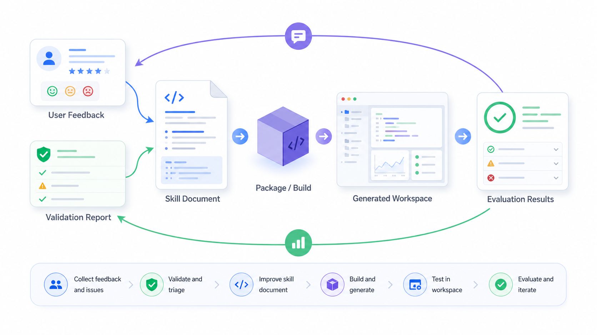

# 07. Skills 编写与迭代教程

目标：学会阅读、修改、发布和验证 QuantPilot Skills，并理解 skill 如何影响生成页面质量。

治理规则见 [Skills 治理规范](../skills-governance.md)。本篇偏教程，重点讲“怎么学、怎么写、怎么改”。

如果说代码是平台的骨架，Skills 就像 Agent 的工作习惯。很多“生成页面不好看”“数据字段没用上”“多标的变成单股页”的问题，最后不是模型不会，而是我们没有把项目内的经验清楚写给它。



这张图用 gpt-image2 生成，用来说明一个 skill 从用户反馈、验证报告、规则修改、打包发布到评测回归的闭环。真正提交前仍要以 registry、changelog、lock 和 `npm run check:skills` 为准。

## Skill 是什么

Skill 可以理解成 Agent 的本地专业手册。模型本身有通用能力，但它不知道 QuantPilot 当前有哪些数据文件、验证规则、页面模板、禁止事项和数据源边界。Skill 把这些项目规则写下来，让 Agent 在生成时遵守。

所以改 skill 的心态不要像“写一段提示词”，更像是在给一位同事写操作手册：你要告诉它什么情况该做什么、遇到例外怎么处理、做完后用什么标准确认没有糊弄过去。

一个 skill 通常回答四个问题：

| 问题 | 例子 |
| --- | --- |
| 什么时候使用 | 用户要生成金融看板时必须用 `quant-visualization-html` |
| 输入是什么 | 当前工作空间、run plan、final data、evidence、用户问题 |
| 输出是什么 | 修改页面文件、写入 data quality、生成验证修复计划 |
| 不能做什么 | 不能 mock 数据、不能引用 CDN、不能把 token 写进页面 |

## 当前核心 Skills

| Skill | 学习重点 |
| --- | --- |
| `quant-run-planner` | 如何把用户问题拆成 run plan、澄清问题和数据需求 |
| `quant-data-registry` | 如何选择主数据源、降级源和字段口径 |
| `quant-symbol-resolver` | 如何解析股票、指数、ETF 名称和代码 |
| `quant-image-extraction` | 如何从截图提取持仓、表格和用户输入 |
| `quant-market-data` | 如何获取实时行情、K 线、指数 ETF 和批量行情 |
| `quant-fundamentals` | 如何处理财务、估值和公告事件 |
| `quant-indicators` | 如何计算趋势、风险、流动性和技术指标 |
| `quant-backtest` | 如何描述策略参数、回测结果和限制 |
| `quant-data-quality` | 如何记录来源、时效、缺失字段和异常 |
| `quant-visualization-html` | 如何生成金融可视化页面并自动修复 |
| `quantpilot-ui-product-design` | 如何约束 UI/UX、信息密度、布局和反模式 |

短期不要轻易新增顶层 skill。大多数能力应放进现有 skill 的 `references/`、`scripts/` 或规则章节。

一个经验判断：如果新规则只是让现有能力更稳定，比如 K 线图更清晰、选股页不要丢字段、缺数据要诚实提示，那它应该进入已有 skill。如果它有完全不同的输入输出、独立脚本和独立验证方式，才考虑新增核心 skill。

## Skill 目录长什么样

```text
.claude/skills/<skill-id>/
  SKILL.md
  references/
  scripts/
  assets/
```

| 文件或目录 | 作用 |
| --- | --- |
| `SKILL.md` | 入口说明，写触发条件、工作流、硬性规则和验证方式 |
| `references/` | 长篇字段说明、模板矩阵、案例库和设计规则 |
| `scripts/` | 确定性计算脚本，例如字段映射、数据质量扫描、收益计算 |
| `assets/` | 模板资源或示例素材，尽量少用，避免包过大 |

`SKILL.md` 应该短而硬。复杂解释放到 references，稳定计算放到 scripts，不要把所有东西都堆在入口文件里。

## 一个好 Skill 的结构

建议按这个顺序写：

```markdown
---
name: quant-example
description: Use this skill when ...
---

# 中文名称

一句话说明这个 skill 解决什么问题。

## 何时使用

明确触发场景。

## 输入

列出需要读取的文件、接口或用户信息。

## 输出

列出必须写入或更新的文件。

## 标准工作流

写成可执行步骤。

## 禁止事项

明确不能伪造、不能跳过、不能访问的内容。

## 验证方式

说明完成后如何检查。
```

写 skill 时不要只写“要好看”“要专业”。要写可执行规则，例如“K 线主图必须有日期轴、价格轴、图例和成交量区域”，“多标的任务不能退化成单股模板”。

越具体的规则，越容易被执行，也越容易被评测覆盖。含糊的形容词会让每次生成都靠运气。

## 修改 Skill 的推荐流程

1. 收集失败案例：截图、验证报告、用户反馈或评测失败。
2. 判断失败原因：数据缺失、模板错配、布局问题、验证规则缺失还是 skill 描述不清。
3. 修改对应 skill 的 `SKILL.md`、`references/` 或 `scripts/`。
4. 更新 `.claude/skills.registry.json` 的版本和描述。
5. 更新 `.claude/skills.changelog.json`。
6. 运行 `npm run package:skills -- <skill-id>`。
7. 运行 `npm run check:skills`。
8. 必要时跑生成页面评测或视觉 smoke。

如果只是修错别字，用 patch 版本；新增规则、模板或脚本，用 minor 版本；破坏已有输出契约才用 major 版本。

## 使用 Skills 管理页面

本地启动后打开：

```text
http://localhost:3000/skills
```

推荐在页面里完成这些操作：

| 操作 | 用途 |
| --- | --- |
| 查看 skill 列表 | 确认状态、版本、文件数和异常 |
| 收起左侧列表 | 让编辑区域有更大空间 |
| 编辑 `SKILL.md` | 调整核心规则和流程 |
| 查看版本 | 理解最近改过什么 |
| 发布 | 自动更新 registry、changelog、tgz 包和 lock |

页面发布失败时会回滚关键文件。命令行手改时没有这个保护，所以更要在提交前跑检查。

## 命令行工作流

```bash
npm run check:skills
npm run check:skills:metadata
npm run package:skills -- quant-visualization-html
npm run check:skills
```

如果一次改多个 skill：

```bash
npm run package:skills
npm run check:skills
```

如果 skill 改动影响生成页面，也建议跑：

```bash
npm run check:validation-repair
npm run check:generated-artifacts
```

## 例子：修复 K 线页面太窄

假设用户反馈：“K 线图太窄，数字太小，底部日期和图形碰撞。”

不要只在某个生成工作空间里手改 CSS。更好的做法是：

1. 打开 `.claude/skills/quant-visualization-html/SKILL.md`。
2. 找到金融看板、A 股行情看板、视觉验收相关章节。
3. 补充可执行规则：
   - K 线主图必须占据主要宽度。
   - 价格轴和日期轴字号要可读。
   - 成交量区域和日期轴之间要留白。
   - 移动端减少刻度，避免碰撞。
4. 如果 UI 规则更通用，同步更新 `quantpilot-ui-product-design`。
5. 更新版本和 changelog。
6. 打包并运行 `npm run check:skills`。
7. 用一个 K 线生成用例验证规则是否真的生效。

这就是把一次用户反馈沉淀成长期能力。

## 例子：新增 DDE 大单策略知识

如果策略目录里出现“近 3 日 DDE 大单金额为正”这类规则，但本地还没有 DDE 字段，不应该让 skill 假装可回测。

正确做法：

1. 在策略或数据 skill 中标记 DDE 是待补数据依赖。
2. 在策略目录展示“需补数据”，而不是“可执行”。
3. 在数据源知识库记录候选 provider 和字段口径。
4. 后续数据入库后，再把规则改为可执行。

Skill 的价值是让 Agent 诚实表达边界，而不是把缺失数据编成结论。

## 常见反模式

| 反模式 | 为什么不好 | 正确做法 |
| --- | --- | --- |
| 新需求就新增 skill | skill 数量膨胀，边界混乱 | 先扩展现有核心 skill |
| 只写“页面要专业” | Agent 无法执行 | 写具体布局、字段和验证规则 |
| 用 skill 要求伪造数据 | 破坏研究可信度 | 缺数据就展示缺口和补数建议 |
| 只改源码不打包 | 生成工作空间仍拿旧包 | 运行 `package:skills` 和 `check:skills` |
| references 写太散 | Agent 难以找到关键规则 | SKILL.md 写入口，references 按场景组织 |
| 脚本输出不稳定 | 难以复用和验证 | 统一 JSON 输入输出 |

## 提交前检查清单

| 检查 | 命令或动作 |
| --- | --- |
| registry/changelog/lock 一致 | `npm run check:skills` |
| 包已更新 | `npm run package:skills -- <skill-id>` |
| TypeScript 不受影响 | `npm run type-check` |
| 生成产物策略仍通过 | `npm run check:generated-artifacts` |
| 文档同步 | 更新 `docs/skills-governance.md` 或本教程 |
| 评测覆盖 | 有代表性用例时运行对应 benchmark |

## 下一步

继续阅读：

- [Skills 治理规范](../skills-governance.md)
- [04. Skills 与可视化看板](04-skills-and-visual-dashboard.md)
- [生成工作空间契约](../generated-workspace-contract.md)
- [Agent 评测指南](../evals-guide.md)
