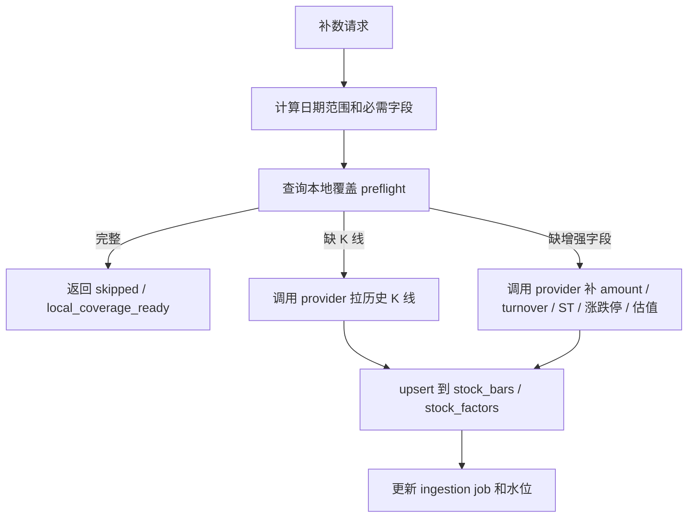

# 行情数据源采集知识库

QuantPilot 的行情链路以 PostgreSQL + TimescaleDB 为事实库，外部数据源只作为采集入口。生成工作空间和策略平台应优先读取本地后端，不要在页面里临时抓网页接口。

## 字段口径

| 目标字段 | 业务含义 | 首选来源 | 备选来源 | 说明 |
| --- | --- | --- | --- | --- |
| `open/high/low/close` | 开高低收 | 东方财富历史 K 线 | AKShare、腾讯、Baostock | 所有策略和 K 线图的基础字段。 |
| `volume` | 成交量 | 东方财富历史 K 线 | AKShare、腾讯、Baostock | 不同源单位可能不同，入库前必须保留 `provider` 和原始字段。 |
| `amount` | 成交额 | 东方财富 f57 | Baostock `amount`、AKShare `成交额` | 当前腾讯兜底通常拿不到成交额，不能用于流动性金额指标。 |
| `previous_close` | 前收盘价 | Baostock `preclose` | 腾讯历史行、本地推导 | 涨跌幅、振幅、涨跌停判断的基础字段。 |
| `amplitude` | 振幅，单位 `%` | 东方财富 f58 | AKShare `振幅` | 可由 `(high-low)/previous_close` 推导，但优先存源字段。 |
| `change_percent` | 涨跌幅，单位 `%` | 东方财富 f59 | AKShare `涨跌幅`、本地推导 | 若源缺失，可由前收盘推导。 |
| `change_amount` | 涨跌额 | 东方财富 f60 | AKShare `涨跌额`、本地推导 | 若源缺失，可由 `close - previous_close` 推导。 |
| `turnover` | 换手率，单位 `%` | 东方财富 f61 | Baostock `turn`、AKShare `换手率` | 不能只用成交量替代，缺失时应展示为空或标记代理口径。 |
| `trade_status` | 交易状态 | Baostock `tradestatus` | 交易所/商业源 | 用于停牌样本过滤和回测可成交性提示。 |
| `is_st` | 是否 ST | Baostock `isST` | 东方财富实时名称、商业源 | 决定涨跌停阈值和风险标签。 |
| `limit_up/limit_down` | 涨跌停标记 | 基于 Baostock `pctChg` 推导 | 交易所规则/商业源 | 按 ST、主板、创业板、科创板、北交所阈值推导，后续可换成精确涨跌停价。 |
| `pe_ttm/pb_mrq/ps_ttm/pcf_ncf_ttm` | 估值因子 | Baostock 日频估值 | Tushare、AKShare、商业源 | 写入 `quant.stock_factors`，股票池列表读取最新值；ETF/指数通常为空。 |

K 线交易字段在 `quant.stock_bars` 中均为正式列，估值类因子写入 `quant.stock_factors`；原始字段继续保存在 `metadata`，便于追溯和重放。

## 采集优先级

1. 东方财富直连：实时行情、分红、公告和证券解析继续作为主链路。
2. 东方财富历史 K 线：如果本机可达，优先用于 OHLCV、成交额、振幅、涨跌幅、涨跌额、换手率。
3. Baostock 历史补数：当东方财富历史端点不可达，使用 `/api/v1/ingestion/baostock/history` 或批量端点补 `amount/amplitude/change_percent/change_amount/turnover/trade_status/is_st/limit_*` 和估值因子。
4. AKShare 历史补数：用于聚合接口验证；如果底层仍走东方财富且本机不可达，降级到 Baostock。
5. 腾讯 K 线兜底：只作为 OHLCV 连续样本兜底，成交额和换手率通常为空，不能覆盖已有增强字段。
6. Tushare：后续作为日频基本面和估值补充，重点字段包括换手率、量比、市盈率、市净率、市值、流通股本。
7. Yahoo/yfinance：只用于海外股票、ETF、指数，不作为 A 股主源。
8. 同花顺 iFinD / Choice / Wind：作为未来商业授权数据源，不和网页公开端点混用。

## 入库规则

- `symbol + timeframe + adjustment + ts` 是 K 线唯一键。
- 不同复权口径单独落库，前复权 `qfq` 是策略平台默认口径。
- 补数只更新同一天同口径记录，不删除已有更早历史。
- 稀疏兜底源不能把已有非空增强字段覆盖成空。
- 每次采集任务写入 `quant.market_data_ingestion_jobs`，每个 provider 的水位写入 `quant.market_data_sync_state`。
- 5857 只 A 股和 ETF/指数池补数必须用批量端点低频推进，前端只展示任务进度和下一批 offset。
- 页面和生成工作空间读取 `/api/v1/research/bars/{symbol}` 或后端封装接口，不直接读数据库。

## 本地优先判断流程

补数前要先问本地库，而不是先问外部接口。



当前 preflight 判断会关注：

| 判断项 | 说明 |
| --- | --- |
| `kline` | 补数区间内是否有足够 K 线 |
| `latest_trade_date` | 本地最新 K 线是否落后于参考最新交易日 |
| `amount`、`turnover` | 成交额和换手率是否覆盖补数窗口 |
| `trade_status`、`is_st` | 停牌和 ST 字段是否覆盖 |
| `limit_up`、`limit_down` | 涨停和跌停标记是否覆盖 |
| `pe_ttm`、`pb_mrq`、`ps_ttm`、`pcf_ncf_ttm` | 估值因子是否覆盖 |

如果这些字段在目标范围内已经完整，后端会返回 `skipped`，并在结果里标记 `skip_reason=local_coverage_ready`。这不是失败，而是说明本地数据已经满足这次补数目标。

## 字段缺失时怎么判断

不是所有缺失都同等严重。

| 缺失 | 对页面影响 | 对策略影响 |
| --- | --- | --- |
| `open/high/low/close` | K 线无法画，趋势无法判断 | 阻断 |
| `volume` | 成交量柱缺失 | 大多数回测还能跑，但流动性判断不完整 |
| `amount` | 成交额为空 | 流动性和资金强弱指标不可信 |
| `turnover` | 换手率为空 | 筹码活跃度判断不可信 |
| `previous_close` | 涨跌幅和涨跌停推导困难 | 涨停、跌停、跳空策略不可信 |
| `trade_status` | 停牌无法明确 | 回测可能把不可成交日当可成交 |
| `is_st` | ST 风险无法过滤 | 涨跌停阈值和风险过滤不可信 |
| DDE 字段 | 页面暂不展示或标记需补数据 | DDE 资金策略不可执行 |

页面宁愿展示“缺成交额，流动性评分不可用”，也不要把缺失字段当成 `0` 继续计算。`0` 是真实数值，空值是未知，两者含义完全不同。

## 当前可执行补数字段链路

```bash
cd services/market-data
uv sync --extra baostock --extra akshare
uv run quantpilot-market-api
```

```bash
curl -X POST 'http://127.0.0.1:8000/api/v1/ingestion/baostock/history' \
  -H 'Content-Type: application/json' \
  -d '{
    "symbols": ["002156.SZ", "002555.SZ", "601398.SH"],
    "period": "daily",
    "adjustment": "qfq",
    "lookback_years": 5,
    "limit": 1260,
    "request_delay_seconds": 1.5
  }'
```

低频批量推进股票池：

```bash
curl -X POST 'http://127.0.0.1:8000/api/v1/ingestion/baostock/history/batch' \
  -H 'Content-Type: application/json' \
  -d '{
    "universe_id": "a-share-sample-research-pool",
    "offset": 0,
    "batch_size": 25,
    "period": "daily",
    "adjustment": "qfq",
    "lookback_years": 5,
    "limit": 1260,
    "request_delay_seconds": 1.2
  }'
```

补数后可用 SQL 验证：

```sql
SELECT
  count(*) FILTER (WHERE amount IS NOT NULL) AS amount_rows,
  count(*) FILTER (WHERE turnover IS NOT NULL) AS turnover_rows,
  count(*) FILTER (WHERE amplitude IS NOT NULL) AS amplitude_rows,
  count(*) FILTER (WHERE trade_status IS NOT NULL) AS trade_status_rows,
  count(*) FILTER (WHERE is_st IS NOT NULL) AS st_rows
FROM quant.stock_bars
WHERE symbol = '002156.SZ'
  AND timeframe = 'daily'
  AND adjustment = 'qfq';
```

```sql
SELECT factor_key, factor_value, ts
FROM quant.stock_factors
WHERE symbol = '002156.SZ'
  AND factor_key IN ('pe_ttm', 'pb_mrq', 'ps_ttm', 'pcf_ncf_ttm')
ORDER BY ts DESC
LIMIT 8;
```

## 页面使用注意

- K 线详情里的成交额、换手率、振幅应来自 `stock_bars` 正式列。
- 如果 `amount` 和 `turnover` 为空，要在数据质量中说明“当前源不提供”，不要展示 `-` 后继续参与流动性评分。
- 趋势、强弱、流动性、估值和状态列优先使用最近一个交易日和 20/60 日滚动窗口。
- 补数任务应以小批次推进；策略页面只暴露低频批次入口和进度，不提供无节制全量入库按钮。
