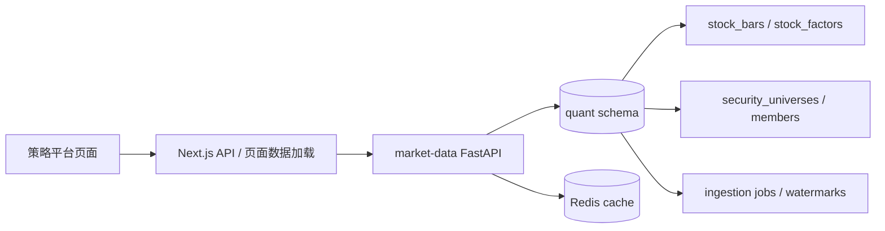

# 策略平台使用与设计指南

策略平台不是一个“股票列表页面”。它的目标是把本地已经沉淀的行情、因子、股票池、数据质量和策略规则组织起来，让选股、买卖价格计划和后续回测都能基于同一套事实。

入口：

```text
http://localhost:3000/strategy-platform
```

## 它解决什么问题

量化研究最容易失控的地方，是页面看起来有很多指标，但每个指标背后的数据口径并不一致。策略平台要做的事情有三件：

| 问题 | 平台内的承载 |
| --- | --- |
| 我研究的是哪些标的 | A 股股票池、ETF/指数池、成员分页和证券主数据 |
| 这些标的数据够不够 | 数据覆盖、K 线详情、缺字段扫描、补数任务 |
| 策略到底依赖什么 | 策略目录、金融知识、基础组件、后续扫描和回测 |

因此，策略平台里任何一个数字都应该能回答两个问题：它来自哪里，它能支持什么决策。答不上来的指标，宁愿先不展示。

## 页面能力

| 区域 | 当前责任 | 不应该承担的事 |
| --- | --- | --- |
| A 股股票池 | 展示个股、板块、行情、强弱、趋势、流动性、估值和数据覆盖 | 不混入 ETF、指数或纯概念列表 |
| ETF/指数池 | 展示 ETF 和指数类标的 | 不参与个股选股策略默认扫描 |
| K 线详情 | 点击某行后展开日/周/月 K 线、MA5/10/20/30/60、涨跌停和分红标记 | 不在表格里一次性加载全部股票明细 |
| 补数弹窗 | 选择增量、近 5 年或自定义日期范围，控制暂停、继续和停止 | 不把长任务铺满股票池主页面 |
| 策略目录 | 保存有实际数据依赖的选股策略和买卖价格策略 | 不放空泛的“策略方案”占位 |
| 基础组件 | 展示交易日历、因子定义、数据质量扫描和平台任务底座 | 不替代具体策略说明 |
| 金融知识 | 解释指标怎么算、适用边界和对股价判断的影响 | 不写成只有名词的百科摘抄 |

## 数据流

策略平台的主路径是：



页面不直接访问外部行情网站。外部数据源只在补数或实时接口里作为采集入口，采集结果最终应落到 PostgreSQL/TimescaleDB，再由后端统一读出。

## 股票池边界

A 股股票池和 ETF/指数池要拆开，原因很朴素：个股策略和 ETF/指数策略的判断对象不同。

| 对象 | 常见策略含义 | 容易踩的坑 |
| --- | --- | --- |
| 普通 A 股 | 选股、趋势、资金、估值和风险过滤 | 需要处理 ST、科创板、北交所、停牌和涨跌停规则 |
| ETF | 行业、主题、指数跟踪或资产配置 | 没有个股财务指标，涨跌停和流动性口径也不同 |
| 指数 | 市场基准和板块参考 | 通常不可直接交易，不能当个股回测 |

拆分只应该调整 `quant.security_universe_members` 的成员关系，不应该删除 `quant.stock_bars` 里的历史 K 线。历史数据是资产，不要因为当前页面暂时不展示就清掉。

## 选股策略和价格策略

当前策略目录最核心应分成两类。

| 类型 | 输出 | 典型问题 |
| --- | --- | --- |
| 选股策略 | 候选股票列表、排序理由、禁止买入原因 | 今天哪些股票符合条件，为什么排在前面 |
| 买入卖出价格策略 | 可接受买入区间、止损、第一止盈、移动止盈或清仓条件 | 已选中的股票，什么价位更合理 |

一个好的选股策略不只是“均线多头排列”。它应写清楚过滤、触发、排序和排除条件。例如：

```text
近 4 日涨停过至少 1 次；
非科创板、非北证、非 ST；
近 3 日 DDE 大单金额为正；
MA5 > MA10 > MA20 > MA30 > MA60；
股价在 MA5 之上；
今天高开、上涨、DDE 大单金额大于 0；
近 5 日 DDE 大单金额为正；
前一日没有下跌；
按大单净量降序；
当日没有涨停。
```

这类策略目前的关键缺口是 DDE 大单资金。没有 DDE 字段时，策略目录应该标记“需补数据”，不能用成交额或换手率假装替代。成交额、换手率可以辅助流动性判断，但不能等价成主力大单。

价格策略则更偏风控。它通常依赖 ATR、均线、前高前低、涨跌停、开盘强弱和计划成本。例如：买入价不追高过多，回踩 MA5 或前收附近更有性价比；跌破 MA10 或放量阴线要降低仓位；涨停次日如果高开过度且回落，要避免追入。

## 补数流程

补数不是每次都全量刷新。当前后端已经支持本地 preflight：

1. 根据股票池、日期范围、复权口径和必需字段生成目标列表。
2. 先查本地 `quant.stock_bars` 和 `quant.stock_factors` 覆盖情况。
3. 如果本地数据完整，返回 `skipped`，`skip_reason=local_coverage_ready`。
4. 如果缺 K 线、最新交易日、成交额、换手率、停牌/ST、涨跌停或估值字段，再调用外部源。
5. 外部源返回后只 upsert 对应日期和口径，不删除更早历史。
6. 长任务写入补数 job，页面通过进度接口查看完成标的、入库行数、预计剩余时间和心跳。

前端的默认选择应是“增量”：从本地最新交易日之后补到当前交易日。第一次建库、补字段或修正历史口径时，再选择“近 5 年”或自定义范围。

## 补数控制

补数任务需要有三种控制语义：

| 控制 | 含义 | 适用场景 |
| --- | --- | --- |
| 暂停 | 当前请求点安全停住，保留 offset 和已完成批次，后续可以继续 | 外部接口不稳定、需要让机器降负载 |
| 继续 | 从保存的 offset 和任务元数据恢复 | 暂停后继续补同一批任务 |
| 停止 | 终止当前任务，保留已入库数据和任务日志，不自动继续 | 日期范围选错、字段口径选错、需要换策略 |

暂停和停止都不应该删除 K 线。它们只影响任务推进，不影响已落库的事实数据。

## 数据够不够支撑策略

判断策略是否可执行，不看页面有多热闹，而看字段是否够用。

| 策略依赖 | 必需数据 | 缺失时的处理 |
| --- | --- | --- |
| 均线趋势 | 连续 `close`，至少覆盖最长均线窗口 | 标记不可回测或缩短窗口 |
| 涨停回踩 | `previous_close`、`change_percent`、`limit_up`、`limit_down`、板块规则 | 不用固定 10% 粗暴判断所有股票 |
| 流动性过滤 | `amount`、`turnover`、近 20/60 日均值 | 缺字段时从候选里降权或剔除 |
| ST/停牌过滤 | `is_st`、`trade_status` | 缺字段时标记风控不完整 |
| DDE 资金策略 | DDE 大单金额、大单净量、连续窗口 | 当前标记需补数据 |
| 估值过滤 | `pe_ttm`、`pb_mrq`、`ps_ttm`、`pcf_ncf_ttm` | ETF/指数为空属正常，个股缺失需说明 |

策略目录里的“数据状态”应该围绕这些依赖判断，而不是只看是否有 K 线。

## UI 取舍

策略平台是高密度工作台，不适合做成营销页。更好的方向是：

- 主表宽一点，减少左右空白，让行情、强弱、趋势和流动性有空间。
- 行内展开 K 线，只展开被点击的那一行。
- 列表页展示高价值摘要，重复字段放到详情里。
- 长任务收进弹窗，主页面只保留“补数”入口和关键状态。
- 对策略使用标签表达核心条件，展开后再看完整逻辑。
- 数据缺失要明确写“缺什么”，不要只显示一个横线。

## 常用排查

| 现象 | 优先看 |
| --- | --- |
| 股票池加载慢 | 是否服务端分页、Redis 缓存是否可用、后端查询是否一次加载全量成员 |
| 行情列全是空 | `quant.stock_bars` 是否有最新交易日，`/api/v1/research/data-coverage` 是否返回覆盖 |
| 成交额和换手率为空 | Baostock/AKShare 补数是否完成，`amount`、`turnover` 是否被空值覆盖 |
| 补数一直显示运行中 | `quant.market_data_ingestion_jobs` 的 parent job 和 child job 心跳 |
| 本地已有数据还重复拉接口 | preflight 必需字段是否过多，日期范围是否超出本地覆盖 |
| 策略显示可执行但结果不可信 | 策略依赖字段是否真的存在，尤其是 DDE、停牌/ST 和涨跌停 |
